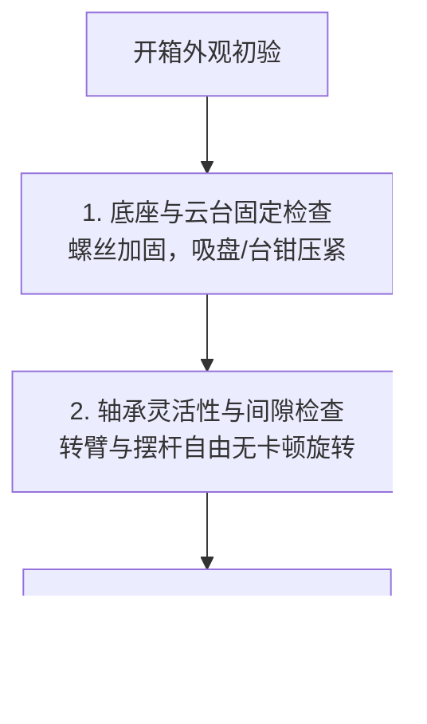

# J280 姿态控制系统竞赛套件 —— 硬件实物开箱检测与标定校准实操指南

> **竞赛项目**：全国大学生嵌入式芯片与系统设计竞赛（FPGA 创新设计赛道 —— 选题一）  
> **适用硬件**：高云 GW2A-LV55 FPGA 板卡 + J280 姿态控制系统竞赛套件  
> **手册目的**：为拿到实物套件后的队伍提供**标准化、工程级的外设开箱检测、电气测试、信号量测、极性统一与零点标定全流程实操规程**。

---

## 零、现场上电启动与标定标准作业规程 (SOP - 必读优先)

> [!IMPORTANT]
> **FPGA 上电启动五步法（避免起摆失败或暴冲打手）**：
> 1. **上电待机**：上电前确保将电机使能拨码开关拉低（`sw_motor_en = 0`，板载引脚 `T2`），电机处于停机封锁状态；
> 2. **扶直摆杆**：操作者用手指将摆杆轻扶至**绝对垂直倒立位置**并保持静止无抖动；
> 3. **一键标定**：按下板载校准按键 `KEY1`（引脚 `V5`，持续约 0.5 秒），内部完成绝对零位捕获并自动写入偏置寄存器；
> 4. **观察指示灯**：观察 `led_calib_ok`（引脚 `N3`）由慢闪变为**高电平长亮**，确认垂直倒立零点标定成功；
> 5. **启动运转**：将转臂手动轻转至正前方 0° 处，短按 `KEY2`（引脚 `V4`）清零转臂圈数，随后将拨码开关推至高电平（`sw_motor_en = 1`），让摆杆自然下垂。系统将立即注入 3.0V 初始扰动脉冲，平滑进入非线性能量泵自动起摆与倒立自平衡！
> 
> *注：若调试过程中转臂超出 ±2 圈触发软限位停机保护（`led_motor_run` 报警闪烁），只需长按 `KEY2` 将位置清零，状态机将自动消除故障并恢复待机起摆，无需频繁断电或硬件复位。*

---

## 目录
0. [现场上电启动与标定标准作业规程 (SOP)](#零现场上电启动与标定标准作业规程-sop---必读优先)
1. [开箱第一步：机械机构健康体检](#一开箱第一步机械机构健康体检)
2. [执行机构：直流电机与 H 桥驱动板实物检测](#二执行机构直流电机与-h-桥驱动板实物检测)
   - [2.1 电枢直流电阻测量与绝缘排查](#21-电枢直流电阻测量与绝缘排查)
   - [2.2 外接可调电源点动与转向检查](#22-外接可调电源点动与转向检查)
   - [2.3 驱动板共地与示波器 PWM 波形量测](#23-驱动板共地与示波器-pwm-波形量测)
   - [2.4 电机机械起动死区电压 $V_{dead}$ 实测方法](#24-电机机械起动死区电压-v_dead-实测方法)
3. [传感系统一：电机正交光电编码器检测与极性调相](#三传感系统一电机正交光电编码器检测与极性调相)
   - [3.1 示波器抓取 A/B 正交 90° 相位差与电平幅值](#31-示波器抓取-ab-正交-90-相位差与电平幅值)
   - [3.2 手转一整圈 4000 CPR 脉冲精度核验](#32-手转一整圈-4000-cpr-脉冲精度核验)
   - [3.3 动力学极性一致性核对（防正反馈发散）](#33-动力学极性一致性核对防正反馈发散)
4. [传感系统二：摆杆角度传感器检测与绝对垂直零点精确标定](#四传感系统二摆杆角度传感器检测与绝对垂直零点精确标定)
   - [4.1 角度输出单调性与机械死区排查](#41-角度输出单调性与机械死区排查)
   - [4.2 SPI 通信时序示波器抓包核实](#42-spi-通信时序示波器抓包核实)
   - [4.3 摆杆绝对垂直倒立零点 ($ADC_{zero}$) 精准标定实操](#43-摆杆绝对垂直倒立零点-adc_zero-精准标定实操)
   - [4.4 摆角倾斜极性与坐标系核对](#44-摆角倾斜极性与坐标系核对)
5. [常见硬件故障排查与急救速查表](#五常见硬件故障排查与急救速查表)

---

## 一、开箱第一步：机械机构健康体检

收到快递包装后，切忌直接通电！倒立摆属于高精度机电耦合机构，剧烈物流震动极易导致螺丝松动、轴承偏心或传感器受力位移。



### 1. 底座固定稳定性检查
* **检查方法**：将套件底座放置在水平平整的实验桌面上。双手轻推底座边缘，观察是否有任何翘动或不平；
* **加固要求**：倒立摆在高速起摆和强烈推力扰动瞬间，反作用力矩极大。**必须使用 G 字夹、台钳或重型强力吸盘将底座死死锁紧在实验桌上**。若底座发生轻微晃动，地面震动将直接破坏平衡控制算法，导致系统永久发散震荡。

### 2. 水平转臂与摆杆轴承灵活性检查
* **转臂轴承检测**：拔掉电机接线，用手指拨动水平转臂，转臂应能轻快回转多圈且声音均匀。若感觉沉重、顿挫或有沙沙摩擦异响，需检查联轴器是否顶紧擦碰底盘，必要时微调紧定螺钉；
* **摆杆轴承微摩擦检测（最关键）**：
  - 将摆杆扶起到约 $45^\circ$ 位置后自然松手，让其自由下垂摆动；
  - **合格标准**：正常的高品质微型双滚珠轴承，摆杆自由往复摆动次数应**不少于 15 ~ 25 个周期**才完全停止；
  - **异常排查**：若摆杆晃动 2 ~ 3 下就仓促停下，说明轴承内圈受压变形、角度传感器联轴器不同心卡死，或轴承内混入杂质。必须松开联轴器重新对中校准，严禁带卡阻调参！

---

## 二、执行机构：直流电机与 H 桥驱动板实物检测

### 2.1 电枢直流电阻测量与绝缘排查
1. **工具**：数字万用表（拨至电阻 $200\,\Omega$ 低阻挡）；
2. **操作**：
   - 将万用表两表笔短接，记录表线短路底阻（如 $0.2\,\Omega$）；
   - 断开电机与驱动板的所有连线，将红黑表笔分别夹在直流电机两根输入动力线裸露端子；
   - 用手极缓慢地轻微旋转电机转子，读取不同转子角度下的阻值，多测 3 ~ 4 个位置并取平均值；
3. **合格判据**：
   - 正常小功率直流电机的电枢线圈电阻 $R_m$ 通常在 **$2.5\,\Omega \sim 8.0\,\Omega$** 之间；
   - 若实测阻值为 $0\,\Omega$：线圈内部匝间短路，**严禁上电，否则当场烧毁驱动板**；
   - 若实测阻值为无穷大（$OL$）：电机电刷碳刷磨损断路或引线断开；
   - 测电机引线与金属外壳之间的绝缘电阻，必须为无穷大（$>20\,\text{M}\Omega$）。

---

### 2.2 外接可调电源点动与转向检查
1. **测试准备**：将实验用可调直流稳压电源电压限制在 **$3.0\,\text{V} \sim 5.0\,\text{V}$**（低压保护），电流限流设定在 **$0.8\,\text{A}$**；
2. **点动测试**：
   - 将稳压源输出短暂碰触电机两引线，观察转臂旋转：
   - 顺时针旋转记为正极性；反接电源线，电机应立刻逆时针旋转；
   - 听电机运行声音：应为轻柔平稳的高频嗡鸣声，无机械尖叫或金属刮擦声；观察稳压源电流表，空载运转电流通常在 **$60\,\text{mA} \sim 150\,\text{mA}$** 之间。

---

### 2.3 驱动板共地与示波器 PWM 波形量测
> [!IMPORTANT]
> **共地（Common Ground）黄金准则**：驱动板的高压动力供电（如 12V 锂电池或开关电源）的地线 `VM_GND`，必须与 FPGA 控制板的数字地 `FPGA_GND` 用**粗导线牢固并联共地**！若两地悬空，PWM 控制信号没有回路基准，驱动板会输出杂乱无章的毛刺或持续烧管。

1. **示波器通道接线**：
   - 示波器地线鳄鱼夹夹在 FPGA / 驱动板共地端；
   - 探头勾在驱动板的 `IN1` 与 `IN2`（或 `PWM` 与 `DIR`）测试点；
2. **波形检查要求**：
   - 载波频率测量：时基缩放至 $10\,\mu\text{s/div}$，观察周期是否严格为 **$50.0\,\mu\text{s}$（$20\,\text{kHz}$）**；
   - 边沿陡峭度：上升沿与下降沿时间应 $< 150\,\text{ns}$，无明显振铃过冲；
   - 占空比线性度：改变程序中的 `pwm_duty`，示波器实测脉宽应成严格正比例线性展开。

---

### 2.4 电机机械起动死区电压 $V_{dead}$ 实测方法
由于机械齿轮与碳刷摩擦阻力的存在，电机加上极微小电压时是不会旋转的。这个导致电机启动的最小临界电压即为**死区电压（Deadband Voltage）**。精确测定此参数对消除倒立摆平衡静差至关重要！

```text
实测步骤：
1. 固定摆臂水平，卸下摆杆；
2. 编写开环调试测试逻辑，或者使用外部可调稳压电源接在电机输入端；
3. 将电压从 0.0V 开始，以 0.05V 为最小刻度缓缓微调递增；
4. 密切目视转臂，当转臂刚刚克服机械静摩擦开始持续微速旋转的瞬间，锁定电压表读数！
5. 重复测试 3 次（正转两次、反转两次），取平均值。
```
* **实测经验范围**：J280 套件减速电机的起动死区电压通常在 **$0.20\,\text{V} \sim 0.35\,\text{V}$**（对应 12V 供电下的占空比约为 $1.6\% \sim 3.0\%$，即千分比计数值 $16 \sim 30$）。测得该值后，填入 `simulation/config.py` 中的 `motor_deadband` 参数。

---

## 三、传感系统一：电机正交光电编码器检测与极性调相

### 3.1 示波器抓取 A/B 正交 90° 相位差与电平幅值
1. **测试连接**：
   - 示波器 CH1 接编码器 A 相输出引脚；
   - 示波器 CH2 接编码器 B 相输出引脚；
   - 确保编码器 VCC 供电稳定（通常为 3.3V 或 5.0V，若为集电极开路输出 OC 门，必须接 $4.7\,\text{k}\Omega$ 上拉电阻至 3.3V）；
2. **动态抓波**：
   - 示波器触发模式设为“Normal（正常）”，CH1 上升沿触发；
   - 用手顺时针均匀旋转水平转臂，观察屏幕波形：
     - CH1 与 CH2 必须均为整齐清晰的方波信号；
     - **正交相位差核实**：CH1 上升沿时，CH2 必须处于低电平中央；CH1 高电平时，CH2 发生上升沿跳变。即两相方波**严格相差 90° 电气角（1/4 周期）**；
   - 用手逆时针旋转：两相相位超前关系应立刻反转（B 超前 A 90°）。

---

### 3.2 手转一整圈 4000 CPR 脉冲精度核验
这是检验 FPGA 内部 `encoder_quad_reader.v` 四倍频解码器与消抖滤波器是否正常工作的决定性测试：
1. **机械对齐标记**：
   - 在旋转转臂底座与静止转台边缘用记号笔或刀刻一条极细的**基准对准线**；
2. **数据监控准备**：
   - 通过按键 `key_pos_clear` 将 FPGA 内部脉冲计数器 `pulse_count` 清零；
   - 利用高云在线逻辑分析仪（GAO）或者串口打印，实时监控 `pulse_count` 寄存器值；
3. **精准旋转一圈**：
   - 用手平稳慢转转臂，绕圆周精准旋转**整整 $360^\circ$（回到刻度对准线）**；
4. **测试结果诊断表**：

| 实测脉冲计数值 | 诊断分析结论 | 现场整改措施 |
| :--- | :--- | :--- |
| **$+3998 \sim +4002$** | **完美！4 倍频与滤波完全正常** | 精度达标，无需修改！ |
| **$+998 \sim +1002$** | **严重错误：仅进行了单倍频计数** | 检查鉴相逻辑，确认是否四个边沿均参与计数。 |
| **$+1998 \sim +2002$** | **错误：仅进行了双倍频计数** | 仅计了单相双边沿，需同时检测 A 相与 B 相跳变。 |
| **$+4500 \sim +8000$ 甚至更大** | **严重电磁毛刺干扰或接触不良** | 1. 调大 `FILTER_CYCLES` 滤波参数；<br/>2. 编码器线远离电机 12V 动力线，加屏蔽层。 |
| **负数（如 $-4000$）** | **方向相反** | 将 Verilog 模块中的 `REVERSE_DIR` 参数改为 1。 |

---

### 3.3 动力学极性一致性核对（防正反馈发散）
> [!CAUTION]
> **闭环控制第一死穴**：电机旋转正方向与编码器增量正方向**必须严格同向**！
> 如果电机给正电压时转臂顺时针转，但编码器读数却在递减（变负），整个控制系统将变成“正反馈自杀模式”，电机一旦使能会瞬间加速猛撞限位甚至烧板！

* **检查标准**：
  在 `j280_hw_top` 中给一个微小的正占空比（如 `pwm_duty = +100`），观察电机旋转带动转臂转动；
  此时读取到的 `pulse_count` 和 `alpha_rad_q16` **必须单调持续递增（向正数增加）**！
  若递减，在顶层直接调换电机 IN1 与 IN2 引脚，或将编码器 A/B 相输入引脚互换。

---

## 四、传感系统二：摆杆角度传感器检测与绝对垂直零点精确标定

### 4.1 角度输出单调性与机械死区排查
用手缓慢旋转摆杆一整圈（$0^\circ \to 360^\circ$），观察 ADC 采样值：
1. **全程无断点**：ADC 计数值应从 0 平稳上升至 4095；
2. **死区检查**：精密电位器在 $355^\circ \sim 360^\circ$ 越界点附近通常有 $2^\circ \sim 5^\circ$ 的物理电刷过渡区。**安装时必须确保该死区过渡区朝向正下方（自然悬垂下垂点），绝对不能让死区位于正上方倒立平衡点附近**！

---

### 4.2 SPI 通信时序示波器抓包核实
将示波器 3 个通道分别接在 `adc_cs_n`、`adc_sclk`、`adc_miso` 上：
* `adc_cs_n` 必须每隔严格的 1.0ms 被拉低一次，宽度约 $6.4\,\mu\text{s}$（16 个时钟）；
* `adc_sclk` 脉冲数必须严格为 16 个周期，时钟频率为 2.5MHz；
* `adc_miso` 在时钟下降沿输出数据，上升沿电平稳定，高低电平幅度标准（高电平 $\ge 3.0\,\text{V}$，低电平 $\le 0.4\,\text{V}$）。

---

### 4.3 摆杆绝对垂直倒立零点 ($ADC_{zero}$) 精准标定实操
这是倒立摆能够长时间稳定直立的最核心基准！若零位偏离哪怕 $1^\circ$，摆杆直立时就会承受不可逆的重力倾覆力矩，导致转臂单向持续狂奔。

```text
标定黄金四步法：
1. 机械直立对准：
   准备一把高精度直角三角板 (或利用磁吸重力铅垂线)，底边紧贴水平底盘桌面，
   垂直边与摆杆轻微贴合，用手将摆杆极其小心地扶正到绝对垂直向上姿态；
2. 消除手部晃动：
   屏住呼吸保持手指微扶摆杆，使摆杆完全静止在垂直 90.0° 铅垂线上；
3. 一键硬件锁存：
   按下板载的 key_zero_calib 标定按键 (持续按压约 0.5 秒)；
   观察板载指示灯 led_calib_ok 是否成功点亮！
4. 验证零位：
   松开按键后，通过逻辑分析仪或打印查看 theta_err_q16，
   此时在摆杆竖直静止时，theta_err_q16 必须在 0 附近极其微小波动 (绝对值 < 0.005 rad)！
```

---

### 4.4 摆角倾斜极性与坐标系核对
* **右手定则方向定义**：
  面对倒立摆正面：
  - 当用手将直立的摆杆**往右倾斜**时，倾角 $\theta$ 必须变为**正值（$\theta_{err} > 0$）**；
  - 当用手将直立的摆杆**往左倾斜**时，倾角 $\theta$ 必须变为**负值（$\theta_{err} < 0$）**；
* **极性纠偏**：若发现左右倾斜与正负号定义完全相反，只需将 `angle_sensor_reader` 模块例化参数中的 `INVERT_DIR` 由 `0` 修改为 `1` 即可在 FPGA 硬件内部瞬间镜像修正！

---

## 五、常见硬件故障排查与急救速查表

| 现场典型异常现象 | 最可能故障原由 | 针对性快速排查与急救方案 |
| :--- | :--- | :--- |
| **现象 1：电机不转，但手摸驱动芯片滚烫发热** | 1. H 桥存在高低边同侧 MOS 管直通短路；<br/>2. 电机电枢线圈内部短路。 | 1. **立即拔掉 12V 动力电源插头**！<br/>2. 用万用表测电机两端阻抗（低于 $1\Omega$ 则电机已坏）；<br/>3. 检查驱动引脚逻辑，确认未出现 IN1=IN2=PWM 异常全导通。 |
| **现象 2：电机发出极其尖锐刺耳的蜂鸣啸叫声** | PWM 载波频率处于人耳听觉区间（例如设成了 1kHz~8kHz）。 | 检查 `CLK_FREQ_HZ` 与 `PWM_FREQ_HZ` 分频参数，严格保证 PWM 频率在 **$20\,\text{kHz}$** 以上。 |
| **现象 3：手转转臂时，编码器计数值狂跳乱蹿，漂移严重** | 1. 信号线受电机电刷火花与 12V PWM 强干扰；<br/>2. 编码器引脚为集电极开路未加上拉电阻；<br/>3. 地线接触虚焊。 | 1. 检查 `FILTER_CYCLES` 消抖参数是否过小（推荐设为 8~16）；<br/>2. 给 A/B 信号线增加 $4.7\,\text{k}\Omega$ 上拉电阻；<br/>3. 编码器连线使用双绞屏蔽线，屏蔽层单端接地。 |
| **现象 4：摆杆转动到某一个角度附近时，数据突然断崖式跳变** | 电位器安装角度不合理，机械死区过渡带正好落在了运动关键区域。 | 松开角度传感器联轴器紧定螺钉，旋转传感器本体角度，**将电位器电刷换向盲区死区旋转至正下方（$180^\circ$ 悬垂点）**，再拧紧紧定螺钉。 |
| **现象 5：手扶正摆杆瞬间，电机突然发疯全速狂奔，越打越快** | **控制极性反了（形成了正反馈发散）！** 电机在向摆杆倾倒的相反方向躲避。 | 1. 立即拍下急停开关或切断使能；<br/>2. 将电机动力输出引脚调换，或在顶层将 `pwm_duty` 乘以 $-1$ 取反。 |
| **现象 6：电机一启动，FPGA 开发板上的 LED 突然闪烁或全灭（芯片复位）** | 电机起动大电流瞬间拉低了 12V 电源，导致板载降压 LDO/DC-DC 输入欠压死机（跌落复位）。 | 1. **禁止电机驱动板与 FPGA 共用细电源线取电**！<br/>2. 在驱动板 12V 输入端并联一颗 $470\,\mu\text{F} \sim 1000\,\mu\text{F}$ 低 ESR 电解电容吸收瞬态冲击电流。 |
