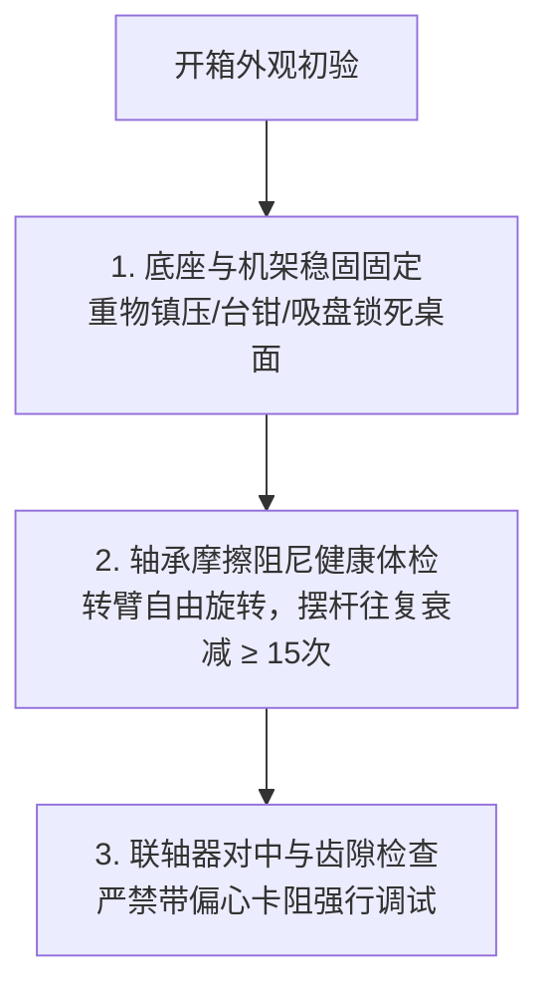
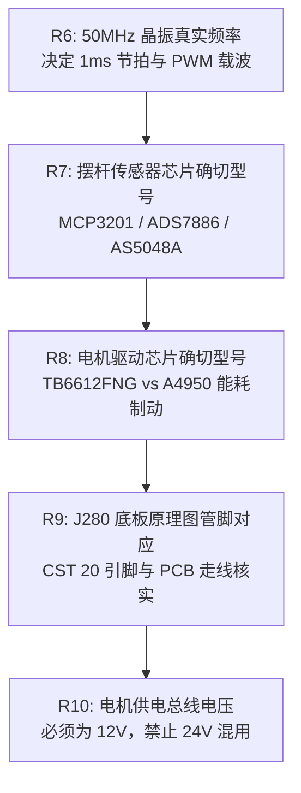

# J280 姿态控制系统竞赛套件 —— 硬件实物开箱检测与标定校准实操指南

> **竞赛项目**：全国大学生嵌入式芯片与系统设计竞赛（FPGA 创新设计赛道 —— 选题一：基于 FPGA 的实时姿态控制系统）  
> **适用硬件**：高云 GW2A-LV55PG484C8/I7 FPGA 核心板 + J280 姿态控制系统竞赛套件  
> **核心规范**：严格对应 `furuta_lqr_ctrl/src/` 硬件源码与 `furuta_lqr_ctrl.cst` 物理引脚约束  
> **手册目的**：为拿到实物套件后的队伍提供**标准化、工程级的外设开箱检测、电气量测、信号示波、极性核定、下板五大硬依赖（R6~R10）排查与零点标定全流程规程**。

---

## 零、现场上电启动与标定标准作业规程 (SOP - 必须严格遵循)

> [!IMPORTANT]
> **FPGA 上电启动八步法（避免起摆失败、打手或绞线）**：
> 1. **上电前待机安全位**：上电前确保将电机使能拨码开关拉低（`sw_motor_en = 0`，板载引脚 `T2`），电机处于停机封锁状态；刹车开关置高（`sw_brake_mode = 1`，板载引脚 `R2`）；
> 2. **上电观察指示灯**：给 FPGA 核心板通电，观察 `led_calib_ok`（板载引脚 `N3`）以约 **1.5Hz 慢闪**，提示系统正在待机并等待垂直零位标定；
> 3. **精准扶正摆杆**：操作者用手指将摆杆轻扶至**绝对垂直倒立位置**（可用直角三角板贴紧底板校准），保持静止无颤抖；
> 4. **一键锁存绝对零位**：按下板载校准按键 `KEY1`（板载引脚 `V5`，持续按压 >20ms），内部硬件消抖后瞬间将当前 ADC 采样值锁存为零位偏置；
> 5. **确认标定成功**：观察 `led_calib_ok` 由慢闪变为**常亮（低电平点亮）**，确认垂直倒立绝对零点标定完成；
> 6. **转臂归零**：将水平转臂用手转动至正前方基准位置（$0^\circ$），**长按 `KEY2`（板载引脚 `V4`，按住 $\ge 0.7\,\text{s}$）**，转臂内部多圈脉冲计数器清零复位；
> 7. **自然下垂**：松开手指，让摆杆在重力作用下自然下垂悬挂于下方（处于倒立摆稳定下垂点）；
> 8. **合闸启动运转**：将使能拨码开关推至高电平（`sw_motor_en = 1`，引脚 `T2`）。状态机立即由 `HANGING` 切入 `SWINGUP`，非线性能量泵驱动转臂往复蓄力晃动 2~3 次，随后在最高点瞬间由 5 阶 LQI 控制器“凌空点穴”无缝接管并锁定直立！
> 
> *注：进入平衡态后，随时可**短按 `KEY2`（<0.7s）** 循环切换目标轨迹模式：`0° 定点` $\to$ `+45° 定点` $\to$ `-45° 定点` $\to$ `0.2Hz 正弦连续跟踪`。若意外触发跌落或软限位保护（LED3 警报快闪），只需拉低 `sw_motor_en = 0` 即可解除故障返回待机！*

---

## 目录
0. [现场上电启动与标定标准作业规程 (SOP)](#零现场上电启动与标定标准作业规程-sop---必须严格遵循)
1. [开箱第一步：机械机构健康体检](#一开箱第一步机械机构健康体检)
2. [执行机构：直流电机与 TB6612 驱动板实物检测](#二执行机构直流电机与-tb6612-驱动板实物检测)
3. [传感系统一：电机 4000 CPR 增量编码器检测与极性校准](#三传感系统一电机-4000-cpr-增量编码器检测与极性校准)
4. [传感系统二：摆杆角度传感器检测与绝对垂直零点精准标定](#四传感系统二摆杆角度传感器检测与绝对垂直零点精准标定)
5. [下板实测前五大硬件绝对依赖（R6~R10）排查清单](#五下板实测前五大硬件绝对依赖r6r10排查清单)
6. [常见现场故障排查与急救速查表](#六常见现场故障排查与急救速查表)

---

## 一、开箱第一步：机械机构健康体检

收到快递包装后，切忌直接通电！倒立摆属于高精度机电耦合机构，剧烈物流震动极易导致螺丝松动、轴承偏心或传感器受力位移。



### 1. 底座固定稳定性检查
* **检查方法**：将套件底座放置在平整刚性的实验桌面上。双手轻推底座边缘，观察是否有任何翘动或间隙；
* **加固要求**：倒立摆在高速起摆和强烈推力扰动瞬间，反作用力矩极大。**必须使用 G 字夹、台钳或重型强力吸盘将底座锁紧在实验桌上**。若底座发生轻微晃动，反扭力矩震动将直接进入传感器采样环路，破坏平衡控制算法，导致系统发散。

### 2. 水平转臂与摆杆轴承灵活性体检
* **转臂轴承检测**：断开电机接线，用手指轻拨水平转臂，转臂应能轻快回转多圈且声音均匀。若感觉沉重、顿挫或有金属刮擦异响，需检查联轴器是否顶紧擦碰底盘，微调止动紧定螺钉；
* **摆杆轴承微摩擦检测（决定起摆成败的关键指标）**：
  - 将摆杆扶起到约 $45^\circ$ 位置后自然松手，让其在重力作用下自由下垂往复摆动；
  - **合格指标**：正常的高品质微型双滚珠轴承，摆杆自由往复摆动次数应**不少于 15 ~ 25 个周期**才完全静止；
  - **异常排查**：若摆杆晃动 2 ~ 3 下就仓促停下，说明轴承内圈受压变形、角度传感器联轴器不同心卡死，或轴承内混入杂质。必须松开联轴器重新对中校准，严禁带卡阻调参！

---

## 二、执行机构：直流电机与 TB6612 驱动板实物检测

### 2.1 电枢直流电阻测量与绝缘排查
1. **工具**：数字万用表（拨至电阻 $200\,\Omega$ 低阻挡）；
2. **操作**：
   - 将万用表两表笔短接，记录表线短路底阻（如 $0.2\,\Omega$）；
   - 断开电机动力线，将红黑表笔分别夹在直流电机两根输入端子；
   - 用手极缓慢地轻微旋转电机转子，读取不同换向槽角度下的阻值，多测 3 ~ 4 个角度取平均；
3. **合格判据**：
   - J280 套件配备的小功率直流减速电机的电枢线圈电阻 $R_m$ 通常在 **$2.5\,\Omega \sim 8.0\,\Omega$** 之间；
   - 若实测阻值为 $0\,\Omega$：线圈内部短路，**严禁通电，否则瞬间烧毁驱动板**；
   - 若实测阻值为无穷大（$OL$）：电机电刷碳刷磨损断路或引线脱焊；
   - 测电机引线与金属外壳之间的绝缘电阻，必须大于 $20\,\text{M}\Omega$。

---

### 2.2 外接可调电源点动与转向检查
1. **测试准备**：将实验用可调直流稳压电源电压限制在 **$3.0\,\text{V} \sim 5.0\,\text{V}$**（低压保护），电流限流设定在 **$0.8\,\text{A}$**；
2. **点动测试**：
   - 将稳压源输出短暂碰触电机两引线，观察转臂旋转：
   - 顺时针旋转记为正极性；反接电源线，电机应立刻逆时针旋转；
   - 听电机运转声音：应为轻柔平稳的高频运转声，无机械尖叫；空载电流通常在 **$60\,\text{mA} \sim 150\,\text{mA}$** 之间。

---

### 2.3 驱动板共地与示波器 20kHz PWM 波形量测
> [!IMPORTANT]
> **共地（Common Ground）黄金准则**：驱动板的高压动力供电（12V 开关电源或电池）的地线 `VM_GND`，必须与 FPGA 控制板的数字地 `FPGA_GND` 用**粗短导线牢固共地**！若两地悬空，PWM 控制信号失去回路参考基准，驱动板将输出不可控杂波或烧毁 MOS 桥臂。

1. **引脚映射**（引自 [`furuta_lqr_ctrl.cst`](file:///C:/Users/28399/Desktop/GoWin/furuta_lqr_ctrl/src/furuta_lqr_ctrl.cst)）：
   - `motor_pwm` $\to$ **H19**，`motor_dir` $\to$ **H18**
   - `motor_in1` $\to$ **G17**，`motor_in2` $\to$ **G18**
   - `motor_stby` $\to$ **F18**
2. **示波器波形量测**：
   - 示波器探头勾在 `motor_in1` 与 `motor_in2` 引脚上；
   - 载波周期应严格为 **$50.0\,\mu\text{s}$（$20\,\text{kHz}$）**；
   - 上升沿与下降沿时间应 $< 150\,\text{ns}$，无剧烈振铃；
   - 调节程序中的 `pwm_duty`，脉宽应随占空比严格线性展开。

---

### 2.4 电机机械起动死区电压 $V_{dead}$ 实测方法
由于机械齿轮与碳刷摩擦阻力的存在，电机加上微小电压时不会旋转。测定起动死区电压对后续消除倒立摆平衡静差至关重要：
1. 固定摆臂水平，卸下摆杆；
2. 稳压电源接电机输入端，电压从 0.0V 开始以 0.05V 逐步递增；
3. 目视转臂，当转臂刚刚克服机械静摩擦开始持续微速旋转瞬间，记录电压值；
4. 正转与反转各测 3 次取平均值。J280 套件减速电机起动死区通常在 **$0.20\,\text{V} \sim 0.35\,\text{V}$**（在 12V 供电下对应千分比占空比计数约 $16 \sim 30$）。

---

## 三、传感系统一：电机 4000 CPR 增量编码器检测与极性校准

### 3.1 示波器抓取 A/B 正交 90° 相位差
1. **接线**：
   - 编码器 A 相 $\to$ **J19**（板载上拉与迟滞）；
   - 编码器 B 相 $\to$ **K19**；
   - 示波器 CH1 接 A 相，CH2 接 B 相；
2. **波形检查**：
   - 手动顺时针匀速旋转水平转臂，观察屏幕：CH1 与 CH2 应为清晰整齐的方波；
   - **正交性核对**：CH1 上升沿时，CH2 必须处于电平中央稳定区，两相**严格相差 90° 电气角（1/4 周期）**；
   - 手动逆时针旋转时，两相相位超前滞后关系对调。

---

### 3.2 手转一整圈 4000 CPR 脉冲精度核验
用于检验 FPGA 内部 [`encoder_quad_reader.v`](file:///C:/Users/28399/Desktop/GoWin/furuta_lqr_ctrl/src/encoder_quad_reader.v) 四倍频与数字消抖滤波器：
1. 在转台底座与转臂边缘划一条极细的对齐标记；
2. 长按 `KEY2` 将内部 `pulse_count` 清零；
3. 手动平稳旋转转臂整整 $360^\circ$ 回到基准线；
4. 脉冲读数诊断：

| 实测脉冲计数值 | 诊断分析结论 | 现场处置措施 |
| :---: | :--- | :--- |
| **$+3998 \sim +4002$** | **完美！4 倍频鉴相与滤波完全正常** | 硬件与逻辑完全健康 |
| **$+998 \sim +1002$** | **严重错误：仅单倍频计数** | 检查模块是否仅响应了单相单边沿 |
| **$+1998 \sim +2002$** | **错误：仅双倍频计数** | 检查是否漏掉了 B 相边沿检测 |
| **$> +4500$ 乱跳** | **存在高频电磁毛刺干扰** | 增大消抖周期 `FILTER_CYCLES`，编码器线与动力线物理隔离 |
| **负数（$-4000$）** | **方向相反** | 在 Verilog 例化中将 `REVERSE_DIR` 参数置 1 |

---

### 3.3 动力学极性一致性核对（防正反馈发散自杀）
> [!CAUTION]
> 电机转动正方向与编码器增量正方向**必须严格同向**！若电机正转时编码器读数递减，系统将陷入正反馈自杀循环，瞬间以最大加速度撞向限位。

- **检查动作**：给电机施加微弱正电压使转臂顺时针旋转，此时读取到的 `pulse_count` 和 `alpha_rad_q16` **必须单调递增（向正数增加）**。若递减，互换电机驱动 IN1/IN2 引线或互换编码器 A/B 相输入。

---

## 四、传感系统二：摆杆角度传感器检测与绝对垂直零点精准标定

### 4.1 SPI 通信时序示波器抓包
- 片选 `adc_cs_n` $\to$ **E19**；时钟 `adc_sclk` $\to$ **E20**；输入 `adc_miso` $\to$ **F19**；
- 示波器抓包核实：
  - `adc_cs_n` 每隔严格的 **1.0ms**（1000Hz）拉低一次，有效脉冲宽度约 $6.4\,\mu\text{s}$；
  - `adc_sclk` 必须为严格的 **16 个时钟脉冲**，频率为 **2.5MHz**；
  - MISO 数据在时钟下降沿移出，上升沿稳定，无毛刺。

---

### 4.2 摆杆绝对垂直倒立零点标定实操
摆杆直立平衡完全依赖该零位基准。若零位偏离 $1^\circ$，系统直立时将持续承受单侧重力倾覆力矩，导致电机单向持续狂奔。

```text
标定四步法：
1. 机械对准：
   用直角三角板贴紧水平底座，垂直边贴靠摆杆，用手将摆杆扶正至绝对垂直 90.0°；
2. 消除手抖：
   屏住呼吸保持手指微扶，确认摆杆完全静止在垂线上；
3. 一键锁存：
   按下板载按键 KEY1（持续按住 >20ms）；
   观察板载 LED2 (led_calib_ok) 由慢闪变为常亮！
4. 验证零位：
   此时读数 theta_err_q16 在静止垂直时必须在 0 附近极微波动 (|θ| < 0.005 rad = 0.28°)。
```

---

### 4.3 摆杆倾斜极性与坐标系核对
- 面对倒立摆正面：
  - 手指将直立摆杆向**右**轻推倾斜，角度误差 $\theta_{err}$ 必须为**正值（$>0$）**；
  - 手指将直立摆杆向**左**轻推倾斜，角度误差 $\theta_{err}$ 必须为**负值（$<0$）**；
- 若反向：在 [`angle_sensor_reader.v`](file:///C:/Users/28399/Desktop/GoWin/furuta_lqr_ctrl/src/angle_sensor_reader.v) 例化中将 `INVERT_DIR` 参数由 0 修改为 1。

---

## 五、下板实测前五大硬件绝对依赖（R6~R10）排查清单

> [!WARNING]
> 仿真和 EDA 工具**无法验证真实硬件外设的电气一致性**。下板联调前必须逐条核对以下 5 个关键物理参数（见 `AGENTS.md` §6）：



### 1. 【R6】板载晶振是否确为 50.000 MHz？
- **影响**：程序中 `CLK_FREQ_HZ = 50_000_000`，1ms 控制节拍（`TIMER_1MS_LIMIT = 50000`）、SPI 2.5MHz 分频器、20kHz PWM 发生器全部以此为基准；
- **排查**：目视核心板主晶振丝印（应标有 `50.000` 或 `50M`），或用示波器实测 M19 引脚时钟频率。

### 2. 【R7】摆杆角度传感器确切芯片型号与时序协议？
- **影响**：当前 `angle_sensor_reader.v` 硬编码接收 16 个 SCLK 并截取 `shift_reg[11:0]`，无 MOSI 输出；
- **排查**：
  - 若实物为 **ADS7886**（12-bit）：时序完全兼容；
  - 若实物为 **MCP3201**：前导 bit 排布不同，需核对有效位窗口；
  - 若实物为 **AS5048A / TLE5012B**（磁编码器）：必须通过 MOSI 发送读寄存器命令字，当前单向 SPI 将无法读取。必须首先确认套件所配传感器芯片型号！

### 3. 【R8】电机驱动芯片确切型号？
- **影响**：当前驱动逻辑为 TB6612FNG 专设，包含 `stby_out` 待机控制和 `IN1=1, IN2=1` 能耗动态刹车模式；
- **排查**：确认驱动板主芯片丝印为 **TB6612FNG** 还是 A4950。

### 4. 【R9】J280 底板原理图与 CST 引脚核对
- **影响**：[`furuta_lqr_ctrl.cst`](file:///C:/Users/28399/Desktop/GoWin/furuta_lqr_ctrl/src/furuta_lqr_ctrl.cst) 中的 20 个引脚在 Gowin PnR 中均合法，但**是否与 J280 底板排针与芯片引脚物理连通必须对照底板原理图核准**；
- **排查**：用万用表蜂鸣挡通断测试，逐一测试 CST 约束引脚与底板外设端子的导通性。

### 5. 【R10】电机供电是否确为 12.0 V？
- **影响**：LQI 输出电压到 PWM 占空比的转换增益 `VOLT_TO_PWM_18 = 85333`（$1024 / 12\text{V}$）和起摆加速度映射均基于 **12V 供电总线**。若实际接入 24V 电源，实际驱动增益将翻倍，直接导致系统起振发散！
- **排查**：用万用表直流电压挡测量电机驱动板动力输入端子，电压必须在 **$11.5\,\text{V} \sim 12.5\,\text{V}$** 范围内。

---

## 六、常见现场故障排查与急救速查表

| 现象 | 最可能故障原由 | 现场急救与排查措施 |
| :--- | :--- | :--- |
| **电机不转，但驱动芯片烫手** | 1. H 桥 MOS 直通短路；<br/>2. 电机电枢内部绕组烧损短路 | 1. **立即拔下 12V 动力插头**！<br/>2. 万用表测电机电阻（$<1\Omega$ 说明电机已坏）；<br/>3. 检查驱动板引线是否有焊锡搭连。 |
| **电机发出刺耳尖啸声** | PWM 频率错误落入人耳敏感区（如 < 10kHz） | 示波器量测 PWM 周期，确保严格为 $50\,\mu\text{s}$（$20\,\text{kHz}$）。 |
| **手转转臂时，编码器计数值狂跳** | 1. 信号线受 12V PWM 强电磁辐射干扰；<br/>2. 编码器为 OC 门未接上拉电阻；<br/>3. 地线虚焊 | 1. 调大滤波参数 `FILTER_CYCLES`；<br/>2. A/B 信号线增加 $4.7\,\text{k}\Omega$ 上拉电阻；<br/>3. 编码器走线使用双绞屏蔽线且远离电机动力线。 |
| **摆杆转到特定角度附近数据跳变** | 电位器安装角度不当，机械死区落在了运动区 | 松开联轴器，**将电位器电刷死区盲区旋转至正下方（$180^\circ$ 悬垂点）**，再紧固螺丝。 |
| **手扶正摆杆瞬间，电机发疯狂奔** | **控制极性反向（形成正反馈）** | 立即拍下 `sw_motor_en = 0`，在顶层互换电机 IN1 与 IN2 引脚或将 `INVERT_DIR` 置 1。 |
| **电机一运转，FPGA 板芯片复位** | 电机起动大电流瞬间拉低了 12V 总线，板载降压 LDO 欠压复位 | 1. 禁止 FPGA 与电机共用细电源线取电；<br/>2. 驱动板 12V 输入端并联 $470\,\mu\text{F} \sim 1000\,\mu\text{F}$ 低阻电解电容。 |
