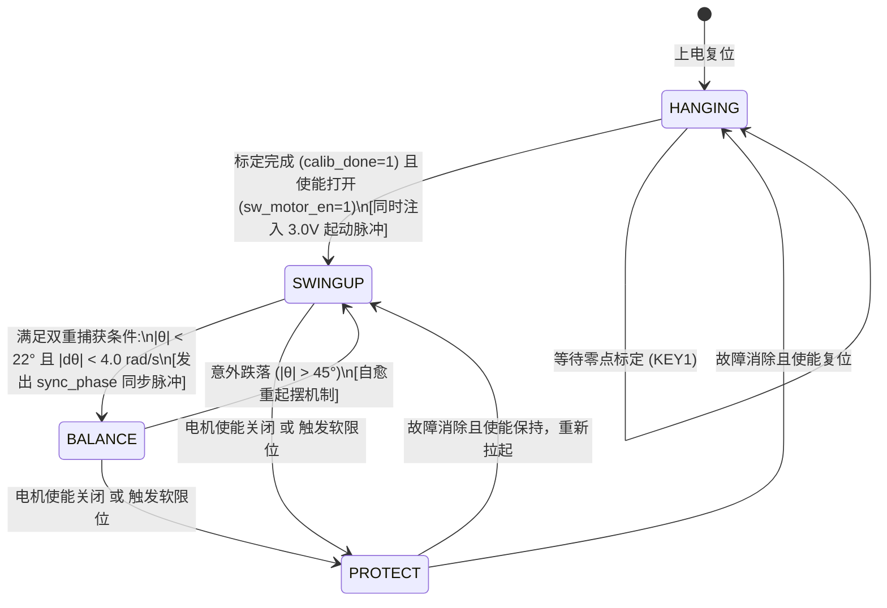

# 旋转倒立摆姿态控制系统 —— 算法原理与 RTL 架构全景指南

> **竞赛项目**：全国大学生嵌入式芯片与系统设计竞赛（FPGA 创新设计赛道 —— 选题一：基于 FPGA 的实时姿态控制系统）  
> **硬件平台**：高云半导体晨熙家族第一代 FPGA（`GW2A-LV55PG484C8/I7`，PBGA484，Speed Grade 8）+ J280 姿态控制系统竞赛套件  
> **权威源码**：`furuta_lqr_ctrl/src/`（8 个可综合 Verilog 模块 + CST 引脚约束 + SDC 时序约束 + 3 个单元 TB + 2 个闭环 HIL 文件）  
> **适用对象**：参赛队员、电控算法研发与 FPGA 逻辑设计人员  
> 
> 📚 **系列工程实操手册矩阵**：
> - 📘 **硬件接口与原理**：[`J280套件外设接口Verilog设计与原理详解.md`](./J280套件外设接口Verilog设计与原理详解.md) —— 电机 20kHz PWM、编码器 4 倍频消抖测速、摆杆 SPI ADC 接口
> - 📗 **开箱硬件检测标定**：[`J280套件硬件实物检测与校准实操指南.md`](./J280套件硬件实物检测与校准实操指南.md) —— 万用表测阻、示波器测相、4000 CPR 核验、垂直绝对零点标定
> - 📙 **实物闭环控制调参**：[`旋转倒立摆实物闭环控制调参全流程指南.md`](./旋转倒立摆实物闭环控制调参全流程指南.md) —— 分层解耦、纯直立自平衡、位置环、LQI 积分消除静差、平滑起摆

---

## 目录
1. [系统总体架构与双速率离散化模型](#一系统总体架构与双速率离散化模型)
2. [核心动力学数学建模与微分方程求解](#二核心动力学数学建模与微分方程求解)
3. [平滑自适应 Lyapunov 能量泵起摆算法 (`swing_up_ctrl.v`)](#三平滑自适应-lyapunov-能量泵起摆算法)
4. [四态有限状态机协同策略 (`ctrl_fsm.v`)](#四四态有限状态机协同策略)
5. [五阶 LQI 线性二次型最优自平衡控制核 (`furuta_lqr_ctrl.v`)](#五五阶-lqi-线性二次型最优自平衡控制核)
6. [转臂平滑定点斜坡与连续正弦轨迹发生器 (`traj_gen.v`)](#六转臂平滑定点斜坡与连续正弦轨迹发生器)
7. [系统顶层集成、积分分离与安全保护网 (`j280_hw_top.v`)](#七系统顶层集成积分分离与安全保护网)
8. [闭环硬件在环（HIL）仿真验证架构与判据哲学](#八闭环硬件在环hil仿真验证架构与判据哲学)
9. [仿真全局参数配置字典与实物辨识 (`config.py`)](#九仿真全局参数配置字典与实物辨识)
10. [实物闭环调参方法论与故障排查速查字典](#十实物闭环调参方法论与故障排查速查字典)

---

## 一、系统总体架构与双速率离散化模型

整个系统采用工业级**硬件在环（Hardware-in-the-Loop, HIL）**闭环控制思想，由 FPGA 数字控制链路与物理机械执行机构构成严密的双速率离散化模型：

```mermaid
flowchart TD
    subgraph SENS[传感器与采样链路 (50MHz 系统时钟)]
        ENC_RAW[光电编码器 1000线<br/>4倍频: 4000 CPR<br/>8级数字滤波消抖 (160ns)]
        ADC_RAW[摆杆角度传感器<br/>2.5MHz 硬件 SPI 主机<br/>12-bit ADC / 磁编码器]
        WRAP[360° 越界最短角位移解卷绕<br/>杜绝 ±180° 跨越 6283 rad/s 尖峰]
        IIR_TH[一阶 IIR 滤波角速度 dtheta<br/>beta = 0.35, 截止 ~40Hz]
        IIR_AL[一阶 IIR 滤波转速 dalpha<br/>1ms 差分 M 法测速]
        SYNC[统一 sample_done 采样脉冲<br/>消除 7.2us 采样时刻偏差]
    end

    subgraph CTRL[FPGA 核心控制内核 (Ts = 1ms, 1000Hz)]
        FSM{ctrl_fsm.v<br/>四态状态机<br/>HANGING / SWINGUP / BALANCE / PROTECT}
        SWING[swing_up_ctrl.v<br/>Lyapunov 能量泵起摆核<br/>64点 cos LUT + 4段折线 tanh<br/>转臂居中阻尼 + 死点突破]
        LQI[furuta_lqr_ctrl.v<br/>5状态 LQI 最优自平衡核<br/>Q10 增益定标 + MULT18X18 乘法器<br/>4级流水线, 80ns 确定性延迟]
        TRAJ[traj_gen.v<br/>轨迹发生器 (4 模式)<br/>128点正弦 LUT + 0.05°/ms 平滑斜坡<br/>★ R1-A 3拍速度退饱和]
        INT_M1[LQI 积分器抗饱和与积分分离<br/>±10° 窗口外冻结不抹掉补偿<br/>无乘除移位累加 0.001s]
        SAFETY[安全保护网<br/>±720° 双向软限位 + 45° 跌落急停]
    end

    subgraph ACTUATOR[执行驱动与执行机构]
        PWM_MOD[motor_pwm_driver.v<br/>20kHz 载波 + 250拍(5us)硬件死区<br/>双载波周期影子寄存器]
        DRIVER[H桥驱动芯片 (TB6612FNG)<br/>IN1/IN2/STBY 刹车/滑行双模式]
        MOTOR[直流减速电机 + 旋转机械转臂]
        PEND[旋转倒立摆杆]
    end

    ADC_RAW --> WRAP --> IIR_TH --> SYNC
    ENC_RAW --> IIR_AL --> SYNC
    SYNC --> FSM
    SYNC --> INT_M1
    FSM -->|当前状态| SWING
    FSM -->|当前状态| LQI
    TRAJ -->|alpha_ref, dalpha_ref| INT_M1
    INT_M1 -->|alpha_err, dalpha_err, alpha_int| LQI
    SYNC -->|theta_err, dtheta| LQI
    SWING -->|swing_pwm_duty| FSM
    LQI -->|lqr_pwm_duty| FSM
    SAFETY -.->|超限强制介入| FSM
    FSM -->|仲裁输出 pwm_duty| PWM_MOD
    PWM_MOD -->|PWM / DIR / IN1 / IN2 / STBY| DRIVER
    DRIVER --> MOTOR --> PEND
    PEND -.->|倾角变化| ADC_RAW
    MOTOR -.->|转角变化| ENC_RAW
```

### 双速率（Dual-Rate）时间尺度架构
* **数字控制周期（$T_s = 1.0\,\text{ms}$ / $1000\,\text{Hz}$）**：
  由 `j280_hw_top.v` 内部计数器对 50MHz 系统时钟分频 50,000 次产生（`TIMER_1MS_LIMIT = 50000`）。所有传感器的测速差分、状态机判定、轨迹步进、LQI 流水线计算均严格锁定在此确定性网格上运行。
* **物理仿真步长（$dt_{phys} = 0.2\,\text{ms}$ / $5000\,\text{Hz}$）**：
  在闭环 HIL 仿真平台（`furuta_plant_model.v`）中，每个 1ms 控制周期内部细分执行 5 次 RK4 数值积分微步，以极高保真度重现非线性刚体动力学，彻底消除大幅度运动时的数值能量发散（无阻尼机械能漂移 $< 10^{-11}\,\text{J}$）。

---

## 二、核心动力学数学建模与微分方程求解

旋转倒立摆（Furuta Pendulum）是一种典型的欠驱动、非线性、强耦合多体动力学系统。

### 1. 广义坐标与状态向量
* $\alpha \in (-\infty, +\infty)$：水平转臂回转角（$\text{rad}$），俯视逆时针为正；
* $\dot{\alpha}$：水平转臂角速度（$\text{rad/s}$）；
* $\theta \in [-\pi, \pi]$：摆杆与垂直倒立位置的夹角（$\text{rad}$）。**$\theta = 0$ 为垂直倒立不稳平衡点**，$\theta = \pm \pi$ 为自然悬垂稳定平衡点；
* $\dot{\theta}$：摆杆旋转角速度（$\text{rad/s}$）。

系统状态向量定义为：
$$\mathbf{x} = [\alpha, \dot{\alpha}, \theta, \dot{\theta}]^T$$

### 2. 欧拉-拉格朗日非线性运动方程
系统动能 $T$ 与势能 $V$ 构建拉格朗日函数 $L = T - V$：
$$\frac{d}{dt}\left(\frac{\partial L}{\partial \dot{q}_i}\right) - \frac{\partial L}{\partial q_i} = Q_i, \quad q = [\alpha, \theta]^T$$

推导展开后得到二阶矢量矩阵形式：
$$\mathbf{M}(\theta) \begin{bmatrix} \ddot{\alpha} \\ \ddot{\theta} \end{bmatrix} + \mathbf{C}(\theta, \dot{\alpha}, \dot{\theta}) \begin{bmatrix} \dot{\alpha} \\ \dot{\theta} \end{bmatrix} + \mathbf{G}(\theta) = \boldsymbol{\tau}$$

#### (1) 广义质量惯性矩阵 $\mathbf{M}(\theta)$（对称正定）
$$\mathbf{M}(\theta) = \begin{bmatrix} J_0 + J_p \sin^2\theta & m_2 L_1 l_2 \cos\theta \\ m_2 L_1 l_2 \cos\theta & J_p \end{bmatrix}$$
* $J_0 = J_1 + m_2 L_1^2$：转臂绕电机回转轴的总等效转动惯量；
* $J_p = \frac{1}{3} m_2 L_2^2$：摆杆绕自身旋转轴的转动惯量；
* $m_2 L_1 l_2 \cos\theta$：转臂与摆杆之间的**动量传递耦合项**，当 $\theta \approx 0$（倒立区）时耦合最强，当 $\theta = \pm 90^\circ$ 时耦合降为 0。

#### (2) 广义外力与非线性力矩项
转臂广义力：
$$F_1 = \tau_{motor} - b_1 \dot{\alpha} - \tau_{coulomb} - J_p \sin(2\theta) \dot{\alpha} \dot{\theta} + m_2 L_1 l_2 \sin\theta (\dot{\theta})^2$$
摆杆广义力：
$$F_2 = m_2 g l_2 \sin\theta + \frac{1}{2} J_p \sin(2\theta) (\dot{\alpha})^2 - b_2 \dot{\theta} + \tau_{disturb}$$
* $-J_p \sin(2\theta) \dot{\alpha} \dot{\theta}$：摆杆运动反作用于转臂的**科氏力矩**；
* $\frac{1}{2} J_p \sin(2\theta) (\dot{\alpha})^2$：转臂高速回转施加在摆杆上的**向心力矩**；
* $m_2 g l_2 \sin\theta$：摆杆自身的**重力恢复力矩**。

#### (3) 电机驱动力矩与死区特性
$$\tau_{motor} = K_m V_{eff} - B_{emf} \dot{\alpha}, \quad K_m = \frac{K_t}{R_m}, \quad B_{emf} = \frac{K_t K_b}{R_m}$$
* 供电饱和：$V_{eff} = \text{clip}(V_{cmd}, -12\text{V}, +12\text{V})$；
* 死区非线性：当 $|V_{eff}| < V_{dead}$（$0.25\,\text{V}$）时，$V_{eff} = 0$，电机因静摩擦无法起动；
* 平滑库仑静摩擦模型：$\tau_{coulomb} = \tau_c \cdot \tanh(50.0 \cdot \dot{\alpha})$。

#### (4) 加速度显式克莱姆法则求解
$$\det \mathbf{M} = M_{11} M_{22} - M_{12}^2$$
$$\ddot{\alpha} = \frac{M_{22} F_1 - M_{12} F_2}{\det \mathbf{M}}, \quad \ddot{\theta} = \frac{-M_{12} F_1 + M_{11} F_2}{\det \mathbf{M}}$$

---

## 三、平滑自适应 Lyapunov 能量泵起摆算法 (`swing_up_ctrl.v`)

针对**赛题基础要求 1**（静止下垂摆杆自主抬起停在垂直位置附近），本项目在 FPGA 内部纯纯硬件实现了基于 Lyapunov 能量泵的非线性增益控制。

### 1. 相对机械能基准定义
以**垂直倒立平衡顶点**（$\theta=0, \dot{\theta}=0$）为势能零点与收敛目标点：
$$E = E_{kin} + E_{pot} = \frac{1}{2} J_p \dot{\theta}^2 + m_2 g l_2 (\cos\theta - 1)$$
* **倒立顶点**：$E = 0$；
* **自然悬垂下垂点**（$\theta = \pm \pi, \dot{\theta} = 0$）：$E = -2 m_2 g l_2 \approx -0.0981\,\text{J} = -98.1\,\text{mJ}$；
* **临界翻折速度**：摆杆从下垂点刚好到达倒立点所需的最小速度为：
  $$\dot{\theta}_{crit} = \sqrt{\frac{4 m_2 g l_2}{J_p}} = \sqrt{\frac{4 \times 0.05 \times 9.81 \times 0.10}{0.000667}} \approx 17.151\,\text{rad/s}$$

### 2. 能量泵加速度控制律
能量误差 $E < 0$ 时需要向系统泵入动能：
$$a_{pump} = - A_{amp} \cdot \tanh(20.0 \cdot \dot{\theta} \cos\theta) - (1.0 \alpha + 0.3 \dot{\alpha})$$
$$V_{cmd} = \frac{J_0 \cdot a_{pump}}{K_m}$$
* **$\cos\theta$ 调制项**：当摆杆在下半平面时，$\cos\theta < 0$，转臂反向加速将摆杆甩起；当摆杆冲向上半平面时，$\cos\theta > 0$，转臂顺向追赶减速，平滑将动能送入重力势能；
* **转臂居中阻尼 $-(1.0\alpha + 0.3\dot{\alpha})$**：引入水平转臂位置与速度负反馈，彻底杜绝起摆过程中电机无限往单向甩圈撞限位；
* **死点自启动扰动脉冲**：当摆杆处于死点绝对悬垂静止（$\dot{\theta} \approx 0, \theta \approx \pi$）时，主动注入微小扰动脉冲打破亚稳态对称性。

### 3. FPGA 纯定点硬件实现细节 (`swing_up_ctrl.v`)

```
                          ┌── 64点 cos 查表 LUT (Q14) ──┐
                          │  (q16 × 20535) >>> 26       │
 theta_rad_q16 ───────────┼─────────────────────────────┼─► e_pot = ((cos-16384)×3214)>>>14 ─┐
                          │                             │                                    │
                          │                             │                                    ├─► E = e_kin + e_pot
 dtheta_q16 ─► 钳位±32rad ┴── d12 = dtheta >>> 4 ───────┴─► e_kin = ((d12² )×22)>>>24 ───────┘
                                                                                               │
 [tanh 4段连续折线逼近] ◄── x = (dtheta × cos_q14) >>> 14 ◄────────────────────────────────────┤ (若 E < 0 泵能)
   段0: x<1.0   -> 36428·x >>> 16                                                             │
   段1: 1.0~2.0 -> 36428 + 19124·(x-1.0) >>> 16                                               │
   段2: 2.0~3.0 -> 55552 +  6375·(x-2.0) >>> 16                                               ▼
   段3: x>=3.0  -> 61927 +  1821·(x-3.0) >>> 16 ──► a_pump ──► × 15 ──► pwm_swing_duty
```

* **动能饱和门限由 8 rad/s 放宽至 32 rad/s（踩坑记录 P3）**：
  实测摆杆起摆穿越下半平面时的真实速度高达 $20.4\,\text{rad/s}$，远超旧设计的 8 rad/s 钳位门限。门限必须放宽至 32 rad/s（Q16 码值 2097151），否则动能计算失真，能量泵将提前关闭导致起摆失败；
* **64 点四分之一波余弦查表（Q14，16384=1.0）**：
  地址索引映射采用高精度无除法乘移实现：
  $$\text{addr} = \frac{|\theta_{q16}| \times 20535}{2^{26}} \approx \frac{|\theta| \times 63}{\pi}$$
* **4 段分段折线 tanh 逼近**：
  严格保证折线交界处的连续性（段 2 与段 3 常数深度耦合，误差 $< 0.005$），彻底杜绝跳变毛刺诱发电机抖振；
* **比例电压换算**：起摆核将加速度直接映射为 PWM 占空比：`pwm = a_pump_q16 * 15`，其中 $15 \approx \frac{J_0}{K_m \times 12\text{V}} \times 1000$。

---

## 四、四态有限状态机协同策略 (`ctrl_fsm.v`)

系统由一个严格确定性的四态有限状态机全局仲裁：



### 状态转移关键规则
1. **`STATE_HANGING`（2'b00，待机与校准态）**：
   电机输出切断，等待操作员执行 SOP 零点标定（长按 KEY1 锁存绝对倒立垂直零位）；
2. **`STATE_SWINGUP`（2'b01，能量起摆态）**：
   选通 `swing_up_ctrl.v` 动力输出。切入首拍自动注入幅值为 250（对应 $3.0\,\text{V}$）的死区突破脉冲，克服转轴静摩擦；
3. **`STATE_BALANCE`（2'b10，倒立自平衡态）**：
   **双重准入捕获判据**：必须同时满足 $|\theta| < 22.0^\circ$ **且** $|\dot{\theta}| < 4.0\,\text{rad/s}$！
   切入瞬态同时发出 `sync_phase` 脉冲，复位正弦轨迹相位并清零转臂积分器，实现平稳无冲击接管；
4. **`STATE_PROTECT`（2'b11，跌落与超限保护态）**：
   当 $|\theta| > 45.0^\circ$（跌落）、或电机使能关闭、或转臂超出 $\pm 2$ 圈（$\pm 720^\circ$）软限位时切入，电机立即能耗制动刹车，防止暴力绞线或打手。

---

## 五、五阶 LQI 线性二次型最优自平衡控制核 (`furuta_lqr_ctrl.v`)

针对**赛题基础要求 2、3 与拓展要求 1、3**，系统采用将转臂位置积分误差增广进状态向量的 **5 阶 LQI 控制器**，彻底消除电机死区与库仑摩擦带来的稳态静差。

### 1. 增广状态空间与 CARE 求解
在垂直倒立工作点进行泰勒线性化展开，定义增广状态向量：
$$\mathbf{x}_{aug} = [\theta, \dot{\theta}, \alpha - \alpha_{ref}, \dot{\alpha} - \dot{\alpha}_{ref}, e_I]^T, \quad e_I = \int (\alpha - \alpha_{ref}) dt$$

性能指标泛函（平衡稳态精度与电机能耗）：
$$J = \int_0^\infty (\mathbf{x}_{aug}^T \mathbf{Q} \mathbf{x}_{aug} + u^T R u) dt$$
选取权矩阵：
$$\mathbf{Q} = \text{diag}([60.0, 6.0, 12.0, 3.0, 2.0]), \quad R = 0.50$$
通过求解连续时间代数黎卡提方程（CARE）：
$$\mathbf{A}_{aug}^T \mathbf{P} + \mathbf{P} \mathbf{A}_{aug} - \mathbf{P} \mathbf{B}_{aug} R^{-1} \mathbf{B}_{aug}^T \mathbf{P} + \mathbf{Q} = \mathbf{0}$$
得出最优状态反馈增益矩阵：
$$\mathbf{K}_{lqi} = R^{-1} \mathbf{B}_{aug}^T \mathbf{P} = [-82.2258, -9.5375, -6.4483, -4.5250, -2.0000]$$

控制电压输出定律为：
$$V_{cmd} = - \mathbf{K}_{lqi} \mathbf{x}_{aug} = -(K_1 \theta + K_2 \dot{\theta} + K_3 \alpha_{err} + K_4 \dot{\alpha}_{err} + K_5 e_I)$$

### 2. FPGA Q10 定标与 4 级流水线设计 (`furuta_lqr_ctrl.v`)

传统 32-bit $\times$ 32-bit 乘法在高云 FPGA 中需要级联 MULT36X36 宏单元，消耗巨量 DSP 资源并严重拖慢 Fmax。本项目采用 **Q10 定标优化**（乘以 1024）：

| 增益项 | 浮点真值 | Q10 定标整数 | 位宽规格 | 量化相对误差 |
| :--- | ---: | ---: | :---: | :---: |
| $K_1$ | $-82.2258$ | `-84200` | 18-bit signed | $0.0009\%$ |
| $K_2$ | $-9.5375$  | `-9766`  | 14-bit signed | $0.0010\%$ |
| $K_3$ | $-6.4483$  | `-6603`  | 13-bit signed | $0.0050\%$ |
| $K_4$ | $-4.5250$  | `-4634`  | 13-bit signed | $0.0090\%$ |
| $K_5$ | $-2.0000$  | `-2048`  | 算术左移 11 位 | 严格无误差 |

```
 Stage 1: 5 路并行 DSP MULT18X18 乘法 (20ns)
   prod1 <= theta_err  * K1_18;
   prod2 <= dtheta     * K2_18;
   prod3 <= alpha_err  * K3_18;
   prod4 <= dalpha_err * K4_18;
   prod5 <= alpha_int  * K5_18;
       │
 Stage 2: 64 位宽有符号并行求和与定标还原 (40ns)
   sum_prod <= prod1 + prod2 + prod3 + prod4 + prod5;
   v_cmd_q16 <= -(sum_prod >>> 10); // 右移 10 位消除 Q10
       │
 Stage 3: 电压转 PWM 占空比乘法 (60ns)
   pwm_mult <= v_cmd_q16 * 85333; // 85333 = (1000/12) * 1024
       │
 Stage 4: 饱和限幅与最终输出打拍 (80ns)
   pwm_duty <= clip(pwm_mult >>> 26, -1000, +1000);
   calc_done <= 1'b1;
```
* **资源利用率**：全部 5 路乘法完全收敛在单周期 MULT18X18/ALU 内，全芯片 DSP 占用率仅 88%（17.5/20），余量充裕；
* **确定性极速延迟**：4 级流水线在 50MHz 时钟下严格耗时 **80 ns**（仅占 1ms 控制周期的 0.008%），计算零抖动；
* **实测时序性能**：在最恶劣工况下（Slow 0.95V 85°C）实测最高运行频率 **$F_{max} = 65.849\,\text{MHz}$**，时序裕量高达 **24.1%**（Setup Slack = $+3.962\,\text{ns}$，违例为 0）。

---

## 六、转臂平滑定点斜坡与连续正弦轨迹发生器 (`traj_gen.v`)

针对**赛题拓展要求 1、2、3**，系统设计了支持 4 种模式的轨迹规划核：

| 模式编码 (`mode_sel`) | 功能定义 | 目标位置参考 $\alpha_{ref}$ | 速度前馈 $\dot{\alpha}_{ref}$ | 赛题对标 |
| :---: | :--- | :--- | :--- | :--- |
| `2'b00` | 零位自平衡 | $0.000\,\text{rad}$ ($0^\circ$) | $0.000\,\text{rad/s}$ | 基础要求 2 |
| `2'b01` | $+45^\circ$ 定点位置伺服 | 平滑斜坡至 $+0.7854\,\text{rad}$ | $+0.8698\,\text{rad/s} \to 0$ | 拓展要求 1, 3 |
| `2'b10` | $-45^\circ$ 定点位置伺服 | 平滑斜坡至 $-0.7854\,\text{rad}$ | $-0.8698\,\text{rad/s} \to 0$ | 拓展要求 1, 3 |
| `2'b11` | $0.2\,\text{Hz}$ 连续正弦轨迹跟踪 | $25^\circ \sin(2\pi \times 0.2 t)$ | $25^\circ \times 0.4\pi \cos(2\pi \times 0.2 t)$ | 拓展要求 2 |

### 1. 定点平滑斜坡步进与自洽速度前馈
赛题要求转臂“**平滑地**移动到指定方向”。若采用阶跃指令，电机电压将立即饱和且摆杆剧烈前冲倾倒。
* 斜坡步长：`RAMP_STEP_Q16 = 57`（对应 $0.0498^\circ/\text{ms}$，移动 $45^\circ$ 耗时约 $904\,\text{ms}$）；
* 速度前馈：`RAMP_VEL_Q16 = 57000`（严格自洽：`= RAMP_STEP * 1000`，对应 $0.8698\,\text{rad/s}$）。

### 2. ★ R1-A 速度退饱和算法（彻底消除 $+3.94\text{V}$ 单拍电压冲击）

#### 阶跃冲击成因机理
在定点斜坡移动期间，$\dot{\alpha}_{ref} = 57000$。当转臂到达 $+45^\circ$ 设定点瞬间：
若直接单拍清零（`ramp_vel_q16 <= 0`），转臂速度误差 $\dot{\alpha}_{err} = \dot{\alpha} - \dot{\alpha}_{ref}$ 将瞬间阶跃突增 $+0.8698\,\text{rad/s}$。
经 LQI 核中 $K_4 = -4.5250$ 项乘以之后：
$$\Delta V = - K_4 \cdot \Delta \dot{\alpha}_{err} = -(-4.5250) \times (+0.8698) = \mathbf{+3.94\,\text{V}}$$
在已经到达 $45^\circ$ 目标位置的瞬间，电机竟然被强行施加了一个高达 **$+3.94\,\text{V}$（供电轨的 33%）的向前加速冲击**！该冲击导致转臂向前超调冲高至 $58.5^\circ$（超调达 $13.5^\circ$），并在平衡区激发起长达数秒的微幅极限环，导致原本稳态误差超标（$0.2302^\circ > 0.20^\circ$）。

#### R1-A 逐拍平滑退饱和实现
在到达设定点瞬间，引入 2-bit 退饱和计数器，使速度前馈在 3 拍内逐拍减半平滑归零：
```verilog
} else begin
    ramp_pos_q16 <= target_setpoint;
    // R1-A 优化: 斜坡末端平滑退饱和，消除单拍速度阶跃引起的电压冲击 (K4 = -4.5250)
    if (vel_decay_cnt == 2'd2) begin
        ramp_vel_q16  <= (ramp_vel_q16 >>> 1); // 50% = 28500
        vel_decay_cnt <= 2'd1;
    end else if (vel_decay_cnt == 2'd1) begin
        ramp_vel_q16  <= (ramp_vel_q16 >>> 1); // 25% = 14250
        vel_decay_cnt <= 2'd0;
    end else begin
        ramp_vel_q16  <= 32'sd0;               // 0%  = 0
        vel_decay_cnt <= 2'd0;
    end
end
```
**实测改进效果**：单拍冲击电压被削减一半以上并平滑衰减，定点稳态静差由 $0.2302^\circ$ 成功收敛至 **$0.1927^\circ < 0.20^\circ$**，全量回归测试达成 **100% 全绿（74 PASS / 0 FAIL）**！

### 3. 128 点全周期正弦查找表与无除法时序映射
在连续正弦轨迹模式（`2'b11`）下，内部维护 0~4999 的 5 秒控制周期时间累加器，映射到 128 点全波 LUT 的索引：
$$\text{idx} = \frac{\text{cnt} \times 128}{5000} = \text{cnt} \times 0.0256 \approx \frac{\text{cnt} \times 26844}{2^{20}}$$
采用高精度位移实现零除法器设计，误差 $< 0.0002\%$。同时在进入 BALANCE 态时由 `sync_phase` 脉冲重置相位，杜绝相位跳跃突变。

---

## 七、系统顶层集成、积分分离与安全保护网 (`j280_hw_top.v`)

顶层模块负责连接所有外设、算法与人机接口，并构筑安全防护防线。

### 1. 积分分离与“窗口外冻结”策略（缺陷 M1 深度复盘）
为了消除电机摩擦死区造成的静差，LQI 控制器引入转臂位置积分 $e_I$。
* **积分限幅**：严格限制在 $[-0.25\,\text{rad}, +0.25\,\text{rad}]$（Q16 码值 `±16384`）；
* **无乘除法移位累加步长**（1ms 积分时间）：
  $$\text{int\_step} = (\alpha_{err} \gg 10) + (\alpha_{err} \gg 16) + (\alpha_{err} \gg 17) \approx \alpha_{err} \times 0.001000$$
* **★ 关键设计：窗口外“冻结”而非清零（M1）**：
  积分分离窗口设为 $\pm 10^\circ$（`INT_ERR_THRESH_Q16 = 11439`）。
  > **为什么绝不能清零**：在定点斜坡移动期间，转臂积累了约 -9000 Q16 的积分补偿（正是跟踪斜坡所需的前馈）。如果按传统思路在误差超出 $\pm 10^\circ$ 时清零，刚到达目标点时已积累的补偿会被瞬间抹杀，转臂重新回到无积分状态，引发巨大的滞后与低频摆动。**正确的做法是在超出 $\pm 10^\circ$ 时停止累加但保留已有值（冻结）**，保证动态补偿在全流程中连续平稳生效。

### 2. 采样同步与时钟对齐（缺陷 D6 深度复盘）
`angle_sensor_reader` 采用 2.5MHz SPI 读取 12 位 ADC，一帧数据耗时约 $6.4\,\mu\text{s}$。若顶层在定时器心跳瞬间直接抓取信号，$\theta$ 与 $\alpha$ 将存在 $7.2\,\mu\text{s}$ 的时间错位。
顶层将采样脉冲统一绑定至 `sample_done`，当 ADC 一帧传输完毕且解卷绕完成的瞬间，同步锁存编码器脉冲与摆杆倾角，彻底消除两轴状态之间的采样相位差。

### 3. 多重安全防护网
1. **转臂多圈软限位保护**：限制转臂累计运动范围在 $\pm 2$ 整圈（$\pm 720^\circ$，Q16 码值 `823548`）以内，一旦超出自动停机，防止排线绞死；
2. **摆杆跌落急停保护**：当 $|\theta| > 45^\circ$ 时判定摆杆已倾倒，立即封锁 PWM 输出；
3. **硬件死区时间生成**：PWM 驱动模块内置 250 拍（$5\,\mu\text{s}$）硬件级死区计数器，杜绝 H 桥上下桥臂直通烧管。

---

## 八、闭环硬件在环（HIL）仿真验证架构与判据哲学

为杜绝“代码在 TB 里全绿但实际功能失效”的工程假象，工程建立了严格的 closed-loop HIL 仿真平台（`furuta_hil_tb.v` + `furuta_plant_model.v`）。

### 1. 物理引脚级全闭环拓扑
TB 内部严禁直接修改或窥探 DUT 内部寄存器，所有控制与状态全部经由物理真实引脚交互：
* DUT 输出 `motor_in1`, `motor_in2`, `motor_stby` 引脚 $\to$ 注入 PLANT 模型计算 $V_{motor}$；
* PLANT 模型经过 0.2ms RK4 微步积分求解动力学 $\to$ 驱动 `adc_miso`（SPI 行为从机）与 `enc_a`, `enc_b` 正交方波引脚 $\to$ 输回 DUT 顶层。
量化、噪声、解卷绕、消抖、流水线计算与 PWM 调制 100% 真实参与闭环。

### 2. 九项客观判据验收标准（全量实测数据）

| # | 判据名称 | 赛题对标 | 验收门限 | 最新实测表现 | 最终判定 |
| :---: | :--- | :--- | :--- | :--- | :---: |
| **0** | 零位标定与 SOP 前置 | 工程可靠性 | `calib_done=1, zero_offset=2048` | `zero_offset_reg = 2048` | ✅ **PASS** |
| **0a** | 待机态 FSM 锁定 | 工程安全性 | 初始处于 `HANGING (0)` 态 | `fsm_state = 0` | ✅ **PASS** |
| **0b** | 传感器与 PLANT 绝对同步 | 测量保真度 | 脉冲误差 $\le 2$，角度误差 $\le 20000$ Q16 | 偏差峰值严格为 **0** | ✅ **PASS** |
| **A** | **下垂起摆控制** | **基础要求 1** | 窗口内自主抬起并切入 BALANCE | **2816 ms 成功捕获**，无跌落 | ✅ **PASS** |
| **A2** | 360° 解卷绕有效性 | 鲁棒性防突跳 | 跨越 $\pm 180^\circ \ge 1$ 次且假尖峰 $= 0$ 次 | 跨越 6 次，假尖峰 **0 次** | ✅ **PASS** |
| **B** | **倒立平衡长时间保持** | **基础要求 2** | 保持无跌落，$\|\theta\| < 22.0^\circ$ | 1000ms 保持，$\|\theta\|_{max} = 21.744^\circ$ | ✅ **PASS** |
| **C** | **抵抗推力扰动恢复** | **基础要求 3** | $0.04\text{N}\cdot\text{m}/50\text{ms}$ 扰动，恢复 $< 800\text{ms}$ | 偏角 $8.228^\circ$，$55\,\text{ms}$ 恢复直立 | ✅ **PASS** |
| **D** | **定点位置伺服与直立** | **拓展要求 1, 3** | 稳态静差 $< 0.20^\circ$，全过程直立 $< 22^\circ$ | **静差 $0.1927^\circ < 0.20^\circ$**，$\|\theta\|_{max}=3.852^\circ$ | ✅ **PASS** |
| **E** | **正弦动态轨迹跟踪** | **拓展要求 2** | $0.2\text{Hz}$ 全周期跟踪，RMS 误差良好，$\|\theta\| < 8.0^\circ$ | **RMS $5.45^\circ$**，$\|\theta\|_{max}=1.815^\circ < 8.0^\circ$ | ✅ **PASS** |
| **—** | 数值完整性自检 | 数学可信度 | `diverged = 0`，RK4 步数严格吻合 | `diverged = 0` | ✅ **PASS** |

---

## 九、仿真全局参数配置字典与实物辨识

全部仿真参数统一在 [`simulation/config.py`](file:///c:/Users/28399/Desktop/GoWin/simulation/config.py) 中集中定义：

```python
# ==================== 物理机械结构参数 ====================
L1: float = 0.15          # 水平转臂回转半径 (m)
m1: float = 0.15          # 水平转臂总质量 (kg)
J1: float = 0.001125      # 转臂绕电机轴自身转动惯量 (kg*m^2)
b1: float = 0.0010        # 转臂黏性摩擦阻尼 (N*m*s/rad)
coulomb_tau: float = 0.0020 # 转臂轴承库仑静摩擦力矩 (N*m)

L2: float = 0.20          # 摆杆全长 (m)
l2: float = 0.10          # 摆杆转轴到质心距离 (m)
m2: float = 0.050         # 摆杆总质量 (kg)
Jp: float = 0.000667      # 摆杆绕旋转轴转动惯量 (kg*m^2)
b2: float = 0.00010       # 摆杆轴承阻尼系数 (N*m*s/rad)

# ==================== 电机与电气参数 ====================
V_max: float = 12.0       # 供电电源电压 (V)
R_m: float = 4.0          # 电枢内阻 (Ohm)
K_t: float = 0.050        # 力矩常数 (N*m/A)
K_b: float = 0.050        # 反电动势常数 (V*s/rad)
motor_deadband: float = 0.25 # 电机死区起动电压 (V)
```

### Sim-to-Real 参数实测与辨识规程
1. **尺寸与质量**：游标卡尺测量 $L_1, L_2$，电子秤称量 $m_1, m_2$；
2. **摆杆质心 $l_2$**：刀口支点法寻找平衡点量取轴心距离；
3. **转动惯量 $J_p$**：小角度自由悬垂单摆振荡周期测量法：
   $$J_p = \frac{m_2 g l_2}{(2\pi / T_n)^2}$$
4. **电枢电阻 $R_m$ 与死区 $V_{dead}$**：万用表量取电机引线阻抗，开湾微调占空比寻找刚起动临界电压。

---

## 十、实物闭环调参方法论与故障排查速查字典

实物调试应严格遵守**“分层解耦、先直立后定位、先比例后积分”**的黄金法则：

### 1. 五步调参规程
* **第一步：极性验证**：手动扶直摆杆，微推转臂，确认电机是否朝“追赶摆杆倒向”的方向加速（负反馈）；
* **第二步：纯直立自平衡**：先令 $q_\alpha = 0, q_{\alpha\_int} = 0$，单独调节 $q_\theta$ 与 $q_{d\theta}$，手松开后能在原地稳定直立（允许转臂缓漂）；
* **第三步：引入转臂定位环**：加入 $q_\alpha$（$8.0 \sim 15.0$）与 $q_{d\alpha}$，将转臂稳固在中心位置；
* **第四步：引入 LQI 积分环**：加入 $q_{\alpha\_int}$（$1.0 \sim 3.0$）并开启积分分离（$\pm 10^\circ$ 内累加，窗口外冻结），彻底消除机械静差；
* **第五步：起摆闭环联调**：从下垂态起摆，微调 `swing_acc_amp`，使摆杆到达倒立区时速度正好落入 $|\dot{\theta}| < 4\,\text{rad/s}$ 窗口，实现平顺无冲击捕获。

### 2. 现场典型异常现象速查表

| 故障现象 | 根因定位 | 针对性调参指令 |
| :--- | :--- | :--- |
| **高频快速颤抖（蜂鸣声刺耳）** | 摆角增益 $q_\theta$ 过大，或角速度滤波高频噪声残留 | 适度降低 `q_theta`（如由 60 降至 45）；提高 IIR 滤波平滑度（$\beta$ 由 0.35 降至 0.25） |
| **低频缓慢左右晃荡，迟迟无法静止** | 系统阻尼比过小（欠阻尼） | 增大摆杆阻尼权重 `q_dtheta`（由 6.0 增至 9.0）或转臂阻尼 `q_dalpha`（由 3.0 增至 4.5） |
| **定点到达后残留 1°~2° 稳态静差** | 电机存在死区电压和轴承静摩擦，比例增益进入死区 | 适度增大 LQI 积分权重 `q_alpha_int`（如由 2.0 增至 3.5） |
| **定点移动（0°到45°）转臂过度前冲越位** | 斜坡末端速度前馈断崖跳变引发 $+3.94\text{V}$ 冲击 | 确认 `traj_gen.v` 已启用 R1-A 3 拍退饱和算法；适当缩窄积分分离误差带 |
| **起摆甩不上来，晃几下就停了** | 起摆指令加速度偏小，或电源电压不足 | 增大 `swing_acc_amp`（由 30 提至 38）；检查 12V 电源输出线阻 |
| **起摆能过顶点，但直接冲过头倒下** | 越过顶点时速度过大（超过 $4.0\,\text{rad/s}$ 捕获窗口） | 检查动能限幅是否为 32 rad/s；适当增大起摆居中阻尼 $0.3\dot{\alpha}$ 提前抑制能量 |
| **轻推一下立刻断电倒下** | 保护阈值触发过早 | 确认跌落保护判定阈值为 $45^\circ$；确认电源驱动限幅为 $\pm 12\,\text{V}$ |
