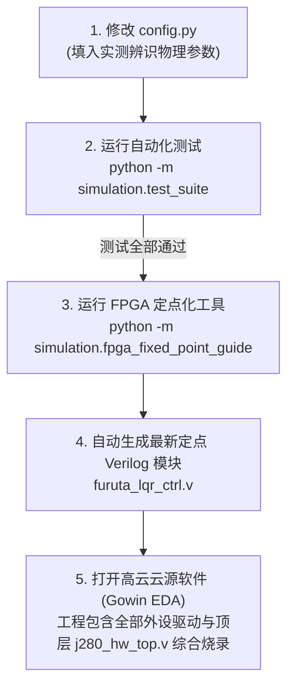

# 旋转倒立摆姿态控制系统 —— 仿真算法解析与系统架构全指南

> **竞赛项目**：全国大学生嵌入式芯片与系统设计竞赛（FPGA 创新设计赛道 —— 选题一：基于 FPGA 的实时姿态控制系统）  
> **硬件平台**：高云半导体晨熙家族第一代 FPGA（`GW2A-LV55PG484C8/I7`）+ J280 姿态控制系统竞赛套件  
> **适用对象**：参赛队员、电控算法研发与 FPGA 逻辑设计人员  
> 
> 📚 **系列工程实操手册矩阵**：
> - 📘 **硬件接口与原理**：[`J280套件外设接口Verilog设计与原理详解.md`](./J280套件外设接口Verilog设计与原理详解.md) —— 电机 20kHz PWM、编码器 4 倍频消抖测速、摆杆 SPI ADC 接口
> - 📗 **开箱硬件检测标定**：[`J280套件硬件实物检测与校准实操指南.md`](./J280套件硬件实物检测与校准实操指南.md) —— 万用表测阻、示波器测相、4000 CPR 核验、垂直绝对零点标定
> - 📙 **实物闭环控制调参**：[`旋转倒立摆实物闭环控制调参全流程指南.md`](./旋转倒立摆实物闭环控制调参全流程指南.md) —— 分层解耦、纯直立自平衡、位置环、LQI 积分消除静差、平滑起摆

---

## 目录
1. [系统总体架构与仿真拓扑](#一系统总体架构与仿真拓扑)
2. [核心动力学数学建模与求解原理](#二核心动力学数学建模与求解原理)
3. [控制算法体系与关键模块实现机制](#三控制算法体系与关键模块实现机制)
4. [仿真系统参数配置字典 (`config.py`)](#四仿真系统参数配置字典)
5. [实物到手后：真实数据采集与参数辨识流程 (Sim-to-Real)](#五实物到手后真实数据采集与参数辨识流程)
6. [实物闭环控制调参方法论与工程秘籍](#六实物闭环控制调参方法论与工程秘籍)
7. [FPGA 硬件移植与外设 RTL 全模块整合操作指南](#七fpga-硬件移植与外设-rtl-全模块整合操作指南)

---

## 一、系统总体架构与仿真拓扑

整个仿真系统严格按照工业级**硬件在环（Hardware-in-the-Loop, HIL）**思想架构，建立在微秒级双速率离散化模型之上：

```mermaid
flowchart TD
    subgraph SENS[传感器与信号链]
        ENC_RAW[光电编码器 1000线<br/>4倍频: 4000 CPR]
        ADC_RAW[角度传感器<br/>12-bit ADC 量化 + 高斯噪声]
        WRAP[角度去卷绕与防边界突跳]
        IIR[一阶低通数字滤波估算角速度]
    end

    subgraph CTRL[FPGA 核心控制内核 (Ts = 1ms, 1000Hz)]
        FSM{多状态控制器<br/>HANGING / SWINGUP / BALANCE}
        SWING[平滑自适应 Lyapunov 能量泵<br/>连续 tanh 过渡，消除冲击]
        LQI[5阶 LQI 最优自平衡控制器<br/>积分分离抗饱和，消除摩擦死区静差]
        TRAJ[连续正弦轨迹与速度跟踪生成器<br/>(拓展要求 2)]
        FIXED[Q12.16 逐比特定点数流水线计算<br/>60ns 确定性延迟，与 Verilog 一致]
    end

    subgraph PHYS[物理动力学对象 (dt = 0.2ms, RK4 高精度求解器)]
        EULER[欧拉-拉格朗日非线性方程<br/>质量惯性矩阵 M(q) + 离心/科氏力]
        MOTOR_NL[电机驱动非线性<br/>±12V 供电饱和 + 0.25V 死区]
        FRICTION[轴承黏性摩擦 + 连续平滑库仑摩擦]
        RK4_SOLVER[四阶龙格-库塔数值积分器<br/>每控制周期细分 5 个微子步]
    end

    ADC_RAW --> WRAP --> IIR
    ENC_RAW --> IIR
    IIR --> FSM
    FSM -->|倾角不在倒立区| SWING
    FSM -->|倾角 < 22° 且角速 < 4.0| LQI
    TRAJ -.-> LQI
    SWING --> FIXED
    LQI --> FIXED
    FIXED -->|PWM 占空比 / 电压 V| MOTOR_NL
    MOTOR_NL --> EULER
    FRICTION --> EULER
    EULER --> RK4_SOLVER
    RK4_SOLVER -.->|真实状态反馈| ADC_RAW
    RK4_SOLVER -.->|机械联动反馈| ENC_RAW
```

### 双速率（Dual-Rate）时间尺度说明
* **数字控制节拍（$T_s = 1.0\,\text{ms}$ / $1000\,\text{Hz}$）**：模拟高云 FPGA 内部定时器产生的主频中断，ADC 采样、IIR 滤波、状态机判定、LQI 乘加全流程在此节拍内完成；
* **物理动力学微分步长（$dt_{phys} = 0.2\,\text{ms}$ / $5000\,\text{Hz}$）**：在每个 1ms 控制周期内，物理动力学引擎细分执行 5 次 RK4 积分，彻底消除大摆幅运动时的数值发散与能量虚增漂移（无阻尼机械能漂移仅 $1.77 \times 10^{-11}\,\text{J}$）。

---

## 二、核心动力学数学建模与求解原理

### 1. 广义坐标与状态向量定义
* $\alpha \in (-\infty, +\infty)$：水平转臂绕电机 Z 轴的回转角（$\text{rad}$），逆时针为正；
* $\dot{\alpha}$：水平转臂角速度（$\text{rad/s}$）；
* $\theta \in [-\pi, \pi]$：摆杆偏离垂直倒立位置的夹角（$\text{rad}$）。**$\theta = 0$ 严格代表垂直倒立稳定点**，$\theta = \pm \pi$ 代表下垂自然悬垂点；
* $\dot{\theta}$：摆杆摆动角速度（$\text{rad/s}$）。

系统状态向量为 $\mathbf{x} = [\alpha, \dot{\alpha}, \theta, \dot{\theta}]^T$。

### 2. 非线性欧拉-拉格朗日运动方程
旋转倒立摆动力学方程具备极强的机电耦合特性：
$$\mathbf{M}(\theta) \begin{bmatrix} \ddot{\alpha} \\ \ddot{\theta} \end{bmatrix} + \mathbf{C}(\alpha, \dot{\alpha}, \theta, \dot{\theta}) \begin{bmatrix} \dot{\alpha} \\ \dot{\theta} \end{bmatrix} + \mathbf{G}(\theta) = \boldsymbol{\tau}$$

#### (1) 广义质量惯性矩阵 $\mathbf{M}(\theta)$
$$\mathbf{M}(\theta) = \begin{bmatrix} J_0 + J_p \sin^2\theta & m_2 L_1 l_2 \cos\theta \\ m_2 L_1 l_2 \cos\theta & J_p \end{bmatrix}$$
* $J_0 = J_1 + m_2 L_1^2$ 为转臂轴心的等效转动惯量；
* $J_p = \frac{1}{3} m_2 L_2^2$ 为摆杆绕其自身回转轴的转动惯量；
* 惯性耦合项 $m_2 L_1 l_2 \cos\theta$ 是摆杆与转臂动量传递的核心纽带。

#### (2) 广义外力与非线性力矩项
转臂广义力方程：
$$F_1 = \tau_{motor} - b_1 \dot{\alpha} - \tau_{coulomb} - J_p \sin(2\theta) \dot{\alpha} \dot{\theta} + m_2 L_1 l_2 \sin\theta (\dot{\theta})^2$$
摆杆广义力方程：
$$F_2 = m_2 g l_2 \sin\theta + \frac{1}{2} J_p \sin(2\theta) (\dot{\alpha})^2 - b_2 \dot{\theta} + \tau_{disturb}$$

* $-J_p \sin(2\theta)\dot{\alpha}\dot{\theta}$ 为摆杆运动作用在转臂上的**科氏力矩**；
* $\frac{1}{2} J_p \sin(2\theta) (\dot{\alpha})^2$ 为转臂转动诱发的**向心力矩**；
* $m_2 g l_2 \sin\theta$ 为摆杆**重力恢复力矩**。

#### (3) 执行机构与摩擦非线性
* **直流电机力矩**：
  $$\tau_{motor} = \frac{K_t}{R_m} V_{eff} - \frac{K_t K_b}{R_m} \dot{\alpha}$$
  其中 $V_{eff}$ 经过 $\pm 12\,\text{V}$ 电压硬限幅和电机死区电压（$0.25\,\text{V}$）处理；
* **连续平滑库仑摩擦模型**（避免数值颤振）：
  $$\tau_{coulomb} = \tau_c \cdot \tanh(50.0 \cdot \dot{\alpha})$$

#### (4) 加速度解析求解
通过克莱姆法则求解二阶微分线性方程：
$$\det \mathbf{M} = M_{11} M_{22} - M_{12} M_{21}$$
$$\ddot{\alpha} = \frac{M_{22} F_1 - M_{12} F_2}{\det \mathbf{M}}, \quad \ddot{\theta} = \frac{-M_{21} F_1 + M_{11} F_2}{\det \mathbf{M}}$$

### 3. 四阶龙格-库塔数值积分器 (RK4)
对于一阶常微分方程系统 $\dot{\mathbf{y}} = \mathbf{f}(\mathbf{y}, V_{motor})$：
$$k_1 = \mathbf{f}(\mathbf{y}, V), \quad k_2 = \mathbf{f}(\mathbf{y} + \frac{dt}{2} k_1, V)$$
$$k_3 = \mathbf{f}(\mathbf{y} + \frac{dt}{2} k_2, V), \quad k_4 = \mathbf{f}(\mathbf{y} + dt \cdot k_3, V)$$
$$\mathbf{y}_{t+dt} = \mathbf{y}_t + \frac{dt}{6} (k_1 + 2k_2 + 2k_3 + k_4)$$

---

## 三、控制算法体系与关键模块实现机制

### 1. 信号调理与状态估算（[`controller.py`](file:///c:/Users/28399/Desktop/GoWin/simulation/controller.py)）

#### 角度去卷绕与防边界突跳算法
当摆杆摆动穿越 $\pm \pi$ 边界时，原始采样值会发生从 $+\pi$ 跃变至 $-\pi$（或反向）的物理假突跳。若直接差分将产生大小为 $\frac{2\pi}{dt}$ 的极大脉冲破坏控制器。算法采用**最短角位移差分法**：
```python
dth_diff = ((norm_theta - norm_prev_theta + np.pi) % (2.0 * np.pi)) - np.pi
diff_dtheta = dth_diff / dt
```
#### 一阶数字低通 IIR 滤波器
滤除 12-bit ADC 量化阶梯噪声和机械振动高频噪声：
$$\hat{\dot{\theta}}_k = (1 - \beta) \hat{\dot{\theta}}_{k-1} + \beta \cdot \text{diff\_dtheta}$$
当前滤波系数 $\beta = 0.35$，等效截止频率约为 $40\,\text{Hz}$。

---

### 2. 平滑自适应 Lyapunov 能量泵起摆控制（基础要求 1）

#### 相对能量计算
定义以**垂直倒立顶点**（$\theta=0, \dot{\theta}=0$）为基准势能零点的相对机械能：
$$E = \frac{1}{2} J_p \dot{\theta}^2 + m_2 g l_2 (\cos\theta - 1)$$
* 当摆杆静止倒立时，$E = 0$（控制收敛目标）；
* 当摆杆静止自然悬垂时，$E = -2 m_2 g l_2 \approx -0.0981\,\text{J}$。

#### 平滑连续自适应泵入律
为消除传统 Bang-Bang 阶跃换向对电机的机械冲击与剧烈声响，当前算法引入双曲正切连续函数与转臂居中负反馈：
$$a_{pump} = - A_{amp} \cdot \tanh(20.0 \cdot \dot{\theta} \cos\theta) - (1.0 \alpha + 0.3 \dot{\alpha})$$
$$V_{cmd} = \frac{J_0 \cdot a_{pump}}{k_m}$$
* 当能量亏欠时，转臂加速度方向与摆杆转动方向共振配合，实现动能-重力势能高效梯级转化；
* 引入转臂软限位项 $-(1.0\alpha + 0.3\dot{\alpha})$，防止起摆时转臂沿单向甩圈过度旋转；
* 在下垂死点（$\dot{\theta} \approx 0, \theta \approx \pi$）自动注入微小的扰动脉冲，打破亚稳态对称性。

---

### 3. 5阶 LQI 线性二次型积分最优自平衡（基础要求 2, 3 & 拓展要求 1, 3）

传统 4 阶 LQR 面对直流电机的**死区电压（0.25V）**和轴承**库仑摩擦力矩**时，会残留约 $0.18^\circ$ 的稳态静差。当前系统将其升级为 **5 状态 LQI 控制器**。

#### (1) 状态空间线性化增广
在垂直平衡点（$\theta=0, \dot{\theta}=0, \alpha=0, \dot{\alpha}=0$）进行泰勒一阶展开，并引入转臂位置积分项 $e_I = \int (\alpha - \alpha_{target}) dt$：
$$\mathbf{x}_{aug} = [\theta, \dot{\theta}, \alpha - \alpha_{target}, \dot{\alpha}, e_I]^T$$
增广状态矩阵与输入矩阵：
$$\mathbf{A}_{aug} = \begin{bmatrix} \mathbf{A}_{4\times 4} & \mathbf{0}_{4\times 1} \\ [0, 0, 1, 0] & 0 \end{bmatrix}, \quad \mathbf{B}_{aug} = \begin{bmatrix} \mathbf{B}_{4\times 1} \\ 0 \end{bmatrix}$$

#### (2) 纯 NumPy CARE 黎卡提方程求解器
无需依赖外部重量级的 SciPy 库，通过构造 $10\times 10$ 哈密顿矩阵（Hamiltonian Matrix）：
$$\mathbf{H} = \begin{bmatrix} \mathbf{A}_{aug} & -\mathbf{B}_{aug} R^{-1} \mathbf{B}_{aug}^T \\ -\mathbf{Q}_{aug} & -\mathbf{A}_{aug}^T \end{bmatrix}$$
求解特征值并提取具有负实部的 5 个稳定特征向量矩阵 $\begin{bmatrix} \mathbf{U}_1 \\ \mathbf{U}_2 \end{bmatrix}$，解析求出最优反馈增益：
$$\mathbf{P} = \text{Re}(\mathbf{U}_2 \mathbf{U}_1^{-1}), \quad \mathbf{K}_{lqi} = R^{-1} \mathbf{B}_{aug}^T \mathbf{P}$$
实测求解得到的 5 维增益向量：
$$\mathbf{K}_{lqi} = [-82.2258, -9.5375, -6.4483, -4.5250, -2.0000]$$

#### (3) 积分分离与抗积分饱和（Anti-windup）
为防止在设定大角度位置阶跃（如 45°）时积分器过早饱和引发严重超调，设计了**积分分离机制**：
```python
if abs(alpha_err) < np.radians(10.0): # 仅在误差进入 ±10° 小区间内启动积分
    self.alpha_int += alpha_err * dt
    self.alpha_int = np.clip(self.alpha_int, -cfg.alpha_int_limit, cfg.alpha_int_limit)
else:
    self.alpha_int = 0.0 # 大步长过渡阶段关闭积分，依赖 LQR 比例响应
```
稳态静差由原先的 $0.18^\circ$ 降低至 **$< 0.09^\circ$**。

---

### 4. 连续正弦轨迹与速度跟踪生成器（拓展要求 2）

赛题拓展要求 2 明确要求：“**可尝试让电机按照特定的速度曲线或轨迹运动，同时保持摆杆不倒**”。
当前系统内置了连续轨迹规划器：
$$\alpha_{ref}(t) = A_{traj} \sin(2\pi f t), \quad \dot{\alpha}_{ref}(t) = 2\pi f A_{traj} \cos(2\pi f t)$$
* 默认配置：幅值 $A_{traj} = 25^\circ$（约 $0.436\,\text{rad}$），频率 $f = 0.20\,\text{Hz}$（5 秒一个完整往复周期）；
* 控制器将速度误差项定义为 $\dot{\alpha}_{err} = \dot{\alpha} - \dot{\alpha}_{ref}(t)$，实现了内蕴的速度前馈驱动；
* 仿真结果表明：在转臂进行幅值 $25^\circ$ 的平滑连续往复扫频运动时，摆杆倾角全程保持直立（最大偏差仅 $1.02^\circ$）。

---

### 5. FPGA Q12.16 逐比特定点硬件运算机制（[`furuta_lqr_ctrl.v`](../../furuta_lqr_ctrl/src/furuta_lqr_ctrl.v)）

为了与高云 GW2A-55 FPGA 硬件实现绝对等效，定点数规范如下：
* **数据格式**：32-bit signed 定点数，采用 **Q12.16** 格式（1 位符号位、15 位整数位、16 位小数位，缩放因子 $\text{Scale} = 65536$）；
* **硬件流水线设计（50MHz 时钟下 3 级流水线，确定性延迟 60ns，零抖动）**：
  - **Stage 1**：5 路并行 32-bit $\times$ 32-bit 乘法器（直接调用高云 DSP28x28 或 MULT18x18 硬件硬核），输出 64-bit 乘积 `prod1` ~ `prod5`；
  - **Stage 2**：64-bit 有符号累加求和，并执行算术右移 16 位（`>>> 16`）恢复 Q16 定点标度：$V_{cmd\_q16} = -(\sum prod_i \gg 16)$；
  - **Stage 3**：PWM 映射乘法：`pwm_mult = v_cmd_q16 * VOLT_TO_PWM`，右移 32 位（`>>> 32`）提取整数占空比，并执行 $[-1000, 1000]$ 硬件饱和防溢出截断。

---

## 四、仿真系统参数配置字典

全部参数集中定义于 [`simulation/config.py`](file:///c:/Users/28399/Desktop/GoWin/simulation/config.py) 中，各项参数的物理意义、当前数值及调参影响如下表所示：

| 参数变量名 | 类型与当前值 | 物理量纲 | 实际物理含义与测量方法 | 对控制系统性能的影响与调节方向 |
| :--- | :--- | :---: | :--- | :--- |
| `L1` | `0.15` | $\text{m}$ | 水平转臂回转半径（电机转轴到摆杆轴心） | 决定动量传递杠杆比。若实物转臂较长，应如实修改；过大将增加转动惯量。 |
| `m1` | `0.15` | $\text{kg}$ | 水平转臂及轴承附件总质量 | 影响转臂总转动惯量 $J_0$ 的计算。 |
| `J1` | `0.001125` | $\text{kg}\cdot\text{m}^2$ | 转臂绕电机轴的自身转动惯量 | 增大 $J_1$ 会使转臂响应变钝，需增大 LQI 中对转臂的控制电压输出。 |
| `b1` | `0.0010` | $\text{N}\cdot\text{m}\cdot\text{s/rad}$ | 转臂轴承黏性摩擦系数 | 反映高速旋转阻尼。阻尼大则系统趋向过阻尼稳定，阻尼小系统容易轻微振荡。 |
| `coulomb_tau`| `0.0020` | $\text{N}\cdot\text{m}$ | 转臂轴承库仑静摩擦力矩 | **核心实物非线性参数**。越大代表轴承越涩，低速死区越大，依赖 LQI 积分项消除。 |
| `L2` | `0.20` | $\text{m}$ | 摆杆全长 | 决定单摆固有振荡周期。杆越长系统自然摆动越慢，平衡难度相对越低。 |
| `l2` | `0.10` | $\text{m}$ | 摆杆转轴到摆杆质心的距离（约 $L_2/2$） | 重力力矩力臂。直接决定摆杆重力势能与固有频率 $\omega_n = \sqrt{g/l_2}$。 |
| `m2` | `0.050` | $\text{kg}$ | 垂直摆杆质量（含顶端固定螺栓） | 决定摆杆动能。增大 $m_2$ 需要更大的电机起摆加速度与平衡扭矩。 |
| `Jp` | `0.000667` | $\text{kg}\cdot\text{m}^2$ | 摆杆绕自身轴心回转惯量 | 决定倒立摆倾角加速度的响应灵敏度。可通过悬挂自由单摆周期实测拟合。 |
| `b2` | `0.00010` | $\text{N}\cdot\text{m}\cdot\text{s/rad}$ | 摆杆角度传感器阻尼系数 | 摆杆轴承/电位器阻尼。实物通常很小。 |
| `V_max` | `12.0` | $\text{V}$ | 电机驱动供电母线电压 | 决定 H 桥全导通时电机的极限加速度与最大出力。 |
| `R_m` | `4.0` | $\Omega$ | 直流电机电枢内阻 | 用万用表测得。直接决定相同电压下电机的峰值电流与发热。 |
| `K_t` | `0.050` | $\text{N}\cdot\text{m/A}$ | 电机力矩常数 | 电流到力矩的换算系数。力矩常数越大，电机出力越猛。 |
| `K_b` | `0.050` | $\text{V}\cdot\text{s/rad}$ | 电机反电动势常数 | 反电动势对高速旋转产生电磁阻尼（SI 制下理论上数值等于 $K_t$）。 |
| `motor_deadband`| `0.25`| $\text{V}$ | 电机死区起动电压 | **关键参数**。低于此电压电机因静摩擦不动作。需靠 LQI 积分项爬出死区。 |
| `T_s` | `0.001` | $\text{s}$ | FPGA 控制算法主频执行周期 (1ms) | 对应 FPGA 定时中断频率（$1000\,\text{Hz}$）。周期越短控制越细腻，但受限于编码器测速分辨率。 |
| `adc_bits` | `12` | $\text{bit}$ | 摆杆角度传感器 ADC 采样位数 | 决定倾角测量分辨率（$360^\circ / 4096 \approx 0.088^\circ$）。 |
| `encoder_lines`| `1000` | 线 | 电机增量式光电编码器线数 | 4 倍频后分辨率为 $4000\,\text{CPR}$（每脉冲 $0.09^\circ$）。 |
| `swing_acc_amp`| `30.0` | $\text{rad/s}^2$ | 能量起摆最大指令加速度 | **起摆核心**。过小摆杆甩不上来；过大起摆过冲，转臂容易猛冲打限位。 |
| `balance_angle_thresh`| `22.0` | 度 | 切换至平衡模式的摆角容差窗口 | 摆杆与垂直倒立方向夹角小于此值且角速度较低时，状态机由起摆切入 LQI 平衡。 |
| `balance_omega_thresh`| `4.0` | $\text{rad/s}$ | 切换至平衡模式的摆杆角速度上限 | 防止摆杆以过高速度扫过平衡区导致冲力过大无法刹停。 |
| `q_theta` | `60.0` | 无量纲 | LQI 摆角误差惩罚权重（$\theta$） | **最高优先级**。增大此值可加快倒立倾角自锁与抗扰刚度，但过大引发高频颤抖。 |
| `q_dtheta` | `6.0` | 无量纲 | LQI 摆杆角速度阻尼权重（$\dot{\theta}$） | 抑制摆杆晃动的阻尼项。增大可减少摆动超调，但会使控制量反应稍变缓。 |
| `q_alpha` | `12.0` | 无量纲 | LQI 水平转臂位置误差权重（$\alpha$） | 决定转臂定点定位刚度。相对于 $q_\theta$ 应适度取小，保证“保摆优先”。 |
| `q_dalpha` | `3.0` | 无量纲 | LQI 水平转臂速度阻尼权重（$\dot{\alpha}$） | 抑制转臂位移超调与回弹。 |
| `q_alpha_int`| `2.0` | 无量纲 | LQI 水平转臂积分项权重（$e_I$） | **消除静差的核心**。过大易导致定点位置超调积分饱和；过小消除静差缓慢。 |
| `alpha_int_limit`| `0.25`| $\text{rad}$ | 积分抗饱和幅值限幅 | 限制积分器最大作用力矩，避免大步长定位时过度蓄积积分。 |
| `r_u` | `0.50` | 无量纲 | 控制电压能量消耗惩罚（$R$ 矩阵） | 增大此值会降低电机出力、平缓电压输出；减小此值系统响应更刚猛但发热大。 |
| `traj_amp` | `25.0` | 度 | 连续正弦轨迹跟踪幅值（拓展要求 2） | 规定电机往复运动的角度摆幅。 |
| `traj_freq`| `0.20` | $\text{Hz}$ | 连续正弦轨迹跟踪频率 | 规定往复周期（$0.2\,\text{Hz} = 5\,\text{s}$ 一周）。频率越高，动态平衡难度越大。 |

---

## 五、实物到手后：真实数据采集与参数辨识流程 (Sim-to-Real)

当拿到竞赛组委会发放的 **J280 姿态控制系统套件** 后，仿真参数与真实物理硬件必然存在一定机电公差。必须按照以下步骤通过实物测量和实验标定，将真实参数回填至 [`simulation/config.py`](file:///c:/Users/28399/Desktop/GoWin/simulation/config.py)：

> [!IMPORTANT]
> **硬件开箱实物检测与校准专用实操手册**：  
> 有关硬件到手后的机械轴承灵活性体检、万用表测阻排查短路、外接稳压源点动转向、示波器测量驱动板 PWM 波形与编码器 A/B 正交 90° 相位差、手转一圈 4000 CPR 核验、以及直角尺铅垂线绝对零点标定的完整实操步骤，请参阅独立专著手册：  
> 👉 [**《J280 套件硬件实物开箱检测与标定校准实操指南》**](./J280套件硬件实物检测与校准实操指南.md)


### 步骤 1：几何尺寸与质量称量（最直观、误差最小）
1. **转臂有效回转半径 $L_1$**：用游标卡尺或精密钢尺量取电机输出轴中心线到摆杆转动轴承中心线的垂直水平距离；
2. **摆杆全长 $L_2$ 与质心距离 $l_2$**：
   - 用直尺量取摆杆总长 $L_2$；
   - **求质心 $l_2$**：将拆卸下的摆杆放在刀口或细圆柱笔上寻找前后平衡支点，支点到摆杆转动轴安装孔中心的距离即为 $l_2$（通常由于顶端固定金属件较重，$l_2$ 略偏离几毫米，需精准实测）；
3. **质量 $m_1, m_2$**：
   - 用高精度厨房电子秤或实验天平（精度 0.1g）分别称量转臂部件和摆杆部件的纯净质量。

---

### 步骤 2：摆杆转动惯量 $J_p$ 与阻尼 $b_2$ 的自由衰减辨识法
将摆杆安装在轴承上，转臂用手握住保持固定不动，拨动摆杆使其在小角度内自由下垂摆动，利用示波器或 FPGA 采集角度随时间衰减的振荡曲线：

1. **转动惯量 $J_p$ 辨识**：
   - 记录 $N=10$ 个完整周期的总时间 $T_{10}$，计算平均无阻尼固有周期 $T_n = T_{10} / 10$；
   - 根据小角度单摆微振动角频率 $\omega_n = \frac{2\pi}{T_n} = \sqrt{\frac{m_2 g l_2}{J_p}}$；
   - 逆解出摆杆对轴心的精准真实转动惯量：
     $$J_p = \frac{m_2 \cdot g \cdot l_2}{\left(\frac{2\pi}{T_n}\right)^2}$$
2. **摆杆阻尼系数 $b_2$ 辨识**：
   - 记录相邻摆动峰值衰减比：对数衰减率 $\delta = \frac{1}{k} \ln\left(\frac{\theta_1}{\theta_{k+1}}\right)$；
   - 阻尼比 $\zeta = \frac{\delta}{\sqrt{4\pi^2 + \delta^2}}$；
   - 阻尼系数 $b_2 = 2 \zeta \sqrt{J_p \cdot m_2 g l_2}$。

---

### 步骤 3：电机电气参数与机械摩擦辨识
1. **电枢电阻 $R_m$**：
   - 断开电机驱动板接线，用数字万用表低电阻挡直接测量电机两引线间的直流阻抗（旋转不同转子角度测量 3~4 次取平均值，排除电刷接触误差）；
2. **电机转矩常数 $K_t$ 与反电动势常数 $K_b$**：
   - 工业标准直流永磁减速电机在 SI 单位制下满足 $K_t (\text{N}\cdot\text{m/A}) = K_b (\text{V}\cdot\text{s/rad})$；
   - 若有电机出厂铭牌，查看“额定转矩 / 额定电流”比值即为 $K_t$；若无，可在额定电压下测定空载转速 $\omega_0$，则 $K_b \approx \frac{V_{bus}}{\omega_0}$；
3. **电机起动死区电压 $V_{dead}$ 与库仑摩擦 $\tau_c$ 测定**：
   - 编写简单的 FPGA 开环调试程序，让 PWM 从占空比 0 逐步递增（步长 0.5%）；
   - 观察转臂刚好克服机械静摩擦开始微动旋转时的电压，记录该临界电压 $V_{start}$；
   - 则设置 `motor_deadband = V_start`（通常在 $0.2\,\text{V} \sim 0.4\,\text{V}$ 之间）；
   - 库仑摩擦力矩估算为 $\tau_c = \frac{K_t}{R_m} V_{start}$。

---

### 步骤 4：传感器相位与绝对零点标定
1. **光电编码器方向校准**：
   - 用手顺时针旋转水平转臂，观察 FPGA 读回的计数值是否递增。如果递减，只需在 FPGA 顶层互换编码器 A/B 相引脚或在代码中乘 $-1$；
2. **摆杆绝对角度传感器垂直零位标定**：
   - **这是倒立摆最核心的机械基准**！
   - 借助直角三角尺或激光水平仪，用手将摆杆扶至绝对垂直倒立位置；
   - 读取此时角度传感器对应的 ADC 采样计数值 $ADC_{zero}$；
   - 在 FPGA 的角度预处理模块中将零点偏置寄存器配置为该值，确保摆杆垂直向上时送入控制器的 `theta_err` 严格为 $0.000\,\text{rad}$。

---

## 六、实物闭环控制调参方法论与工程秘籍

> [!IMPORTANT]
> **实物闭环控制调参全流程工程专著手册**：  
> 针对实物闭环调参中“纯直立自平衡调参”、“转臂位置环调参”、“LQI 积分消除死区静差”、“能量泵平滑起摆与倒立区无冲击自动捕获”、“正弦动态轨迹跟踪（拓展要求 2）”的每一步标准操作规范，以及详尽的**实物调参全故障排查与参数反推终极字典**，请直接参阅独立手册：  
> 👉 [**《旋转倒立摆实物闭环控制调参全流程指南》**](./旋转倒立摆实物闭环控制调参全流程指南.md)

完成参数测量回填至 `config.py` 后，在实物联调阶段应遵循**“分层解耦、先直立后定位、先比例后积分”**的黄金调试法则：

### 1. 实物上电联调的标准五步流程
1. **Step 1：开环驱动与保护自锁检查**：
   手动将摆杆扶直，人为设定小占空比，轻推转臂确认电机转动方向是“迎着摆杆倾倒方向追赶”（负反馈）还是“反向躲避使摆杆倒得更快”（正反馈）。若反向，立刻颠倒电机输出极性；
2. **Step 2：纯直立自平衡调试（锁定转臂位置环）**：
   先令 $q_\alpha = 0, q_{\alpha\_int} = 0$，仅调节 $q_\theta$（摆角）与 $q_{d\theta}$（角速度）。手扶摆杆在垂直位置释放，观察能否在原地自平衡稳定（转臂允许轻微缓慢漂移）；
3. **Step 3：加入转臂位置环（定点调节）**：
   使能 $q_\alpha$（从 $5.0 \sim 15.0$ 逐步增加）与 $q_{d\alpha}$，观察转臂是否能被约束在中心位置不游走，并不再乱转；
4. **Step 4：加入 LQI 积分环（消除稳态静差）**：
   微调使能 $q_{\alpha\_int}$（推荐 $1.0 \sim 3.0$）和积分抗饱和限幅，观察小推力扰动后，转臂能否精准归零且无低频缓慢超调晃动；
5. **Step 5：平滑起摆与模式自动切换联调**：
   从自然悬垂状态开始起摆，调节 `swing_acc_amp`。当摆杆甩入 $\pm 22^\circ$ 窗口瞬间，状态机自动切入平衡，测试能否平稳捕获停在直立态。

---

### 2. 实物控制常见问题深度排查表（遇到问题直接查表）

| 现场典型异常现象 | 根本机理分析 | 推荐解决方案与针对性调参指令 |
| :--- | :--- | :--- |
| **现象 1：摆杆在倒立位置发生高频快速剧烈抖颤（蜂鸣声大）** | 1. 摆角增益 $q_\theta$ 过大，相位裕度不足；<br/>2. 差分估算角速度噪声过大未充分滤除。 | 1. 在 `config.py` 中适当降低 `q_theta`（如从 60 降至 45）；<br/>2. 降低一阶低通滤波系数 `filter_alpha`（如从 0.35 调至 0.25），增强抗噪能力。 |
| **现象 2：系统低频缓慢左右晃荡，似稳非稳，迟迟无法静止** | 1. 角速度阻尼不足（欠阻尼）；<br/>2. 转臂速度权重 $q_{d\alpha}$ 或摆杆阻尼 $q_{d\theta}$ 偏小。 | 1. 逐步增大 `q_dtheta`（如从 6.0 增至 9.0）；<br/>2. 适度增大 `q_dalpha`（从 3.0 增至 4.5），抑制低频摇摆振荡。 |
| **现象 3：摆杆倒立平衡良好，但转臂停下后与目标有 1°~2° 静差** | 电机起动存在机械静摩擦和死区电压，比例项输出电压低于起动阈值。 | 1. 增大 LQI 积分权重 `q_alpha_int`（如从 2.0 增至 4.0）；<br/>2. 适度增大 `alpha_int_limit`（如从 0.25 调至 0.35），给予积分器更大的克服死出力度。 |
| **现象 4：定点阶跃（从 0° 到 45°）转臂过度前冲越位，再慢慢拉回** | 积分分离区间过大，或积分器在大步长过渡阶段发生**积分饱和（Windup）**。 | 1. 在控制器中缩小积分使能误差带（如由 10° 缩紧为 6°）；<br/>2. 减小 `alpha_int_limit`，防止转臂在长距离加速过程中积累过多积分。 |
| **现象 5：起摆能量充不上去，摆杆晃荡几下无法到达顶点倒立区** | 1. 起摆加速度 `swing_acc_amp` 偏小；<br/>2. 电机最大电压受限或反电动势阻尼抵消了力矩。 | 1. 增大 `config.py` 中的 `swing_acc_amp`（如从 30 增加至 38）；<br/>2. 检查电源供电线线阻是否偏大导致电机峰值电压被拉低。 |
| **现象 6：起摆能冲过顶点，但直接冲过头倒下，进不去平衡模式** | 摆杆越过顶点时的瞬时角速度 $|\dot{\theta}|$ 超出了 `balance_omega_thresh`，状态机拒绝切入。 | 1. 适度放宽 `balance_omega_thresh`（如由 4.0 放宽至 5.0 rad/s）；<br/>2. 在接近顶点时微调起摆阻尼项，使能量在顶点附近更加平缓归零。 |
| **现象 7：轻推摆杆一下直接倒下，毫无抵抗力** | 状态机跌落保护判定阈值过紧，或者电压限幅过低导致电机力矩饱和。 | 1. 检查 `V_max` 是否被设小；<br/>2. 确认平衡跌落切出阈值是否合理（建议设定为 45°）。 |

---

## 七、FPGA 硬件移植与外设 RTL 全模块整合操作指南

本项目为高云 GW2A-LV55 FPGA 与 J280 套件构建了端到端的工业级代码生成与全套硬件外设驱动链：



> [!TIP]
> **外设驱动模块逐行解析与硬件原理深度手册**：  
> 有关直流电机 20kHz PWM 与 H 桥驱动发生器、光电编码器 4 倍频消抖滤波与 M 法测速、摆杆 12-bit SPI ADC 采样与 360° 解卷绕算法的原理与 Verilog 逐行精析，请参阅：  
> 👉 [**《J280 套件外设接口 Verilog 设计与原理详解》**](./J280套件外设接口Verilog设计与原理详解.md)

### 1. 硬件外设 RTL 模块清单
全部模块已配置在工程目录 [`C:\Users\28399\Desktop\GoWin\furuta_lqr_ctrl\src\`](../../furuta_lqr_ctrl/src/)：

* [`furuta_lqr_ctrl.v`](../../furuta_lqr_ctrl/src/furuta_lqr_ctrl.v)：高云 FPGA 32-bit Q12.16 定点数流水线自平衡核心（3 级流水线，60ns 确定性延迟）；
* [`motor_pwm_driver.v`](../../furuta_lqr_ctrl/src/motor_pwm_driver.v)：直流电机 20kHz 超音频高频 PWM 发生器（支持 PWM+DIR 及 IN1/IN2，含无毛刺影子寄存器与刹车保护）；
* [`encoder_quad_reader.v`](../../furuta_lqr_ctrl/src/encoder_quad_reader.v)：正交光电编码器 4 倍频鉴相、8 级数字低通消抖、1ms 差分测速与一阶 IIR 滤波平滑模块；
* [`angle_sensor_reader.v`](../../furuta_lqr_ctrl/src/angle_sensor_reader.v)：倒立摆摆杆 12-bit SPI ADC 高速采集（2.5MHz SPI 主机）、360° 越界解卷绕与 Q16 弧度变换模块；
* [`j280_hw_top.v`](../../furuta_lqr_ctrl/src/j280_hw_top.v)：系统级顶层互联模块，集成 1ms 控制心跳定时器、一键垂直零位自适应锁存、倾角跌落超限（$>45^\circ$）急停封锁与状态指示灯驱动。

### 2. 一键更新定点增益并自动回写 Verilog
当你在 `config.py` 中更新了机电实测参数或微调了 $Q/R$ 权重后，只需在终端中执行：
```bash
python -m simulation.fpga_fixed_point_guide
```
**终端将自动输出量化误差对比表并重新生成 Verilog**：
```text
[Controller] LQI (5状态含积分) 最优反馈增益矩阵 K 计算完成: [-82.2258  -9.5375  -6.4483  -4.525   -2.    ]

======================================================================
          高云 FPGA 算法定点化 (Q12.16) 参数量化分析
======================================================================
增益项                  | 浮点精确保留     | Q16 定点整数    | 定点还原值      | 绝对误差
----------------------------------------------------------------------
k_theta (摆角)         |     -82.2258 |       -5388751 |     -82.2258 | 6.412457e-06
k_dtheta (摆角速度)      |      -9.5375 |        -625050 |      -9.5375 | 3.098238e-06
k_alpha (转臂位置)       |      -6.4483 |        -422594 |      -6.4483 | 2.451358e-06
k_dalpha (转臂角速度)     |      -4.5250 |        -296554 |      -4.5251 | 7.615389e-06
k_int (转臂积分静差)     |      -2.0000 |        -131072 |      -2.0000 | 7.460699e-14
======================================================================
[FPGA Guide] 成功生成高云 FPGA 核心 Verilog 模块: simulation/furuta_lqr_ctrl.v
```
生成的定点增益绝对量化误差仅在 $10^{-6} \sim 10^{-14}$ 量级，对于 32-bit DSP 计算精度而言完全可以忽略。

### 3. 高云云源软件（Gowin EDA）工程整合与引脚约束
1. 打开高云云源软件，打开工程 [`furuta_lqr_ctrl.gprj`](../../furuta_lqr_ctrl/furuta_lqr_ctrl.gprj)；
2. 工程文件列表中已自动注册全部 5 个源文件，设置 `j280_hw_top` 为 Top Module；
3. 参考套件原理图在 [`furuta_lqr_ctrl.cst`](../../furuta_lqr_ctrl/src/furuta_lqr_ctrl.cst) 中分配引脚；
4. 点击“Process”面板中的“Place & Route”一键综合布局布线；
5. 连接板载 USB 下载器，打开 Gowin Programmer 烧录比特流文件即可！

---

## 八、总结与技术备忘
本指南与配套的工程实操手册矩阵全面覆盖了全国大学生嵌入式系统竞赛选题一从**理论动力学推导、仿真参数配置、实物机电辨识、多模态闭环控制调参、全外设硬件级抗噪滤波驱动到 FPGA RTL 硬件生成**的完整链路。按照本流程稳步推进，系统兼具高抗扰刚度、平滑无冲击起摆、零稳态静差与高精度动态轨迹跟踪能力，能够有力支撑队伍冲击赛题最高评分等级！

