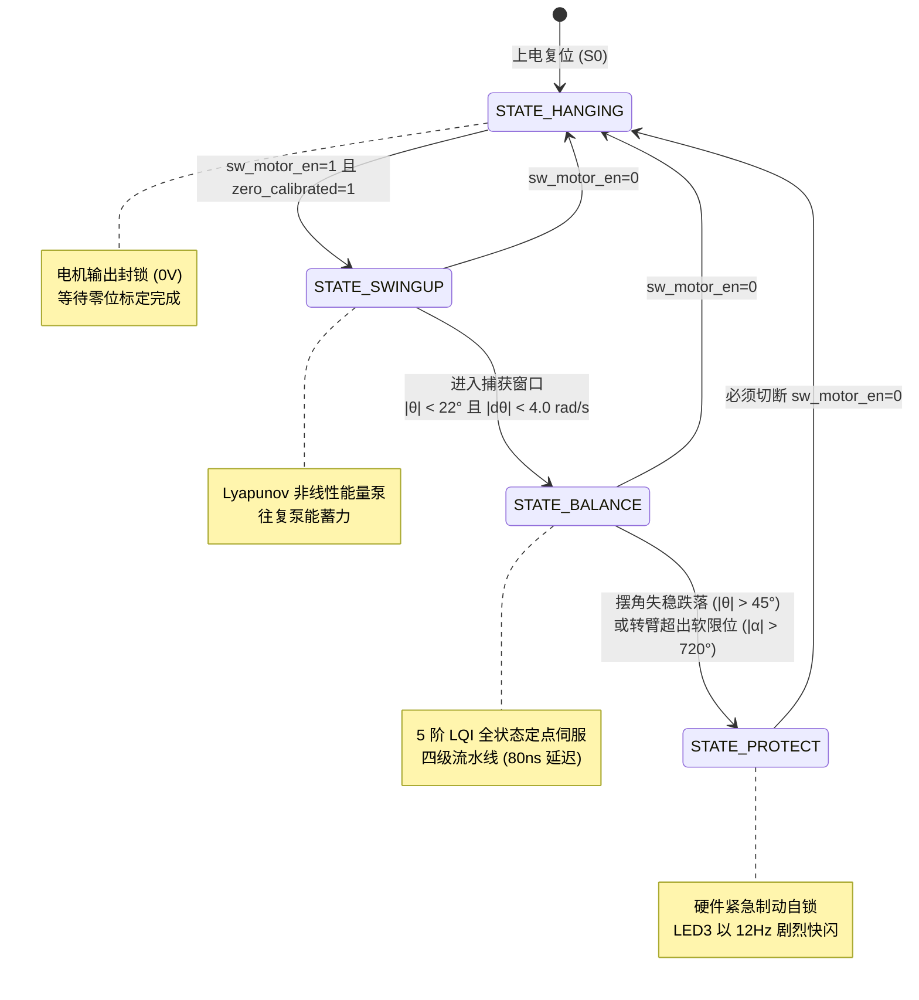

# 旋转倒立摆姿态控制系统 —— 实物闭环控制调参全流程工程指南

> **适用项目**：全国大学生嵌入式芯片与系统设计竞赛（FPGA 创新设计赛道 —— 选题一：基于 FPGA 的实时姿态控制系统）  
> **算法体系**：平滑自适应 Lyapunov 能量泵起摆 + 5阶 LQI 最优自平衡定点伺服控制 + R1-A 速度渐变前馈 + M1 积分分离冻结  
> **硬件平台**：高云 GW2A-LV55PG484C8/I7 FPGA + J280 姿态控制系统竞赛套件  
> **核心规范**：严格对应 `furuta_lqr_ctrl/src/` 权威硬件源码（50MHz 系统时钟 / 1ms 控制周期 / Q12.16 定点链路）

---

## 目录
1. [系统拓扑与人机交互接口映射](#一人机交互接口映射与控制状态机)
2. [控制架构与黄金解耦调参哲学](#二控制架构与黄金解耦调参哲学)
3. [阶段一：摆杆纯直立自平衡调参（姿态刚度与阻尼）](#三阶段一摆杆纯直立自平衡调参姿态刚度与阻尼)
4. [阶段二：水平转臂位置环调参（防游走与中心回位）](#四阶段二水平转臂位置环调参防游走与中心回位)
5. [阶段三：LQI 积分环调参（抗死区静差与 M1 冻结抗饱和）](#五阶段三lqi-积分环调参抗死区静差与-m1-冻结抗饱和)
6. [阶段四：Lyapunov 能量泵起摆与无冲击自动捕获联调](#六阶段四lyapunov-能量泵起摆与无冲击自动捕获联调)
7. [阶段五：四模式轨迹跟踪与 R1-A 平滑过渡实测（拓展要求）](#七阶段五四模式轨迹跟踪与-r1-a-平滑过渡实测拓展要求)
8. [实物调参全故障排查与参数反推终极字典](#八实物调参全故障排查与参数反推终极字典)

---

## 一、人机交互接口映射与控制状态机

在下板调试前，必须明确 FPGA 板载开关、按键、LED 与控制核心的直接映射关系，所有交互均已在 [`j280_hw_top.v`](file:///C:/Users/28399/Desktop/GoWin/furuta_lqr_ctrl/src/j280_hw_top.v) 中完成硬件消抖与状态仲裁。

### 1.1 板载物理引脚与功能定义表

| 物理信号 | 板载引脚 | 电气属性 | 交互类型 | 硬件行为与控制逻辑 |
| :--- | :---: | :---: | :---: | :--- |
| `clk_50m` | **M19** | LVCMOS33 | 50MHz 晶振 | 系统时钟源，分频产生 1ms 控制节拍与 20kHz PWM |
| `rst_n` | **U1** | 上拉+迟滞 | 复位按键 | 全局硬件异步复位（低电平有效） |
| `sw_motor_en` | **T2** | 上拉输入 | 拨码开关 SW1 | **电机总使能**：`1` 启动运转/自动起摆；`0` 安全停机 |
| `sw_brake_mode` | **R2** | 上拉输入 | 拨码开关 SW2 | **停机刹车模式**：`1` 能耗动态制动（IN1=IN2=1）；`0` 自由滑行 |
| `key_zero_calib` | **V5** | 上拉+迟滞 | 独立按键 KEY1 | **摆杆绝对零位标定**：消抖 20ms，锁存当前 ADC 为 $0^\circ$ 倒立平衡点 |
| `key_pos_clear` | **V4** | 上拉+迟滞 | 复合按键 KEY2 | **双功能复合按键**：<br/>• **短按（<0.7s）**：轮换轨迹模式（0° $\to$ +45° $\to$ -45° $\to$ 0.2Hz 正弦）；<br/>• **长按（$\ge$0.7s）**：将转臂脉冲计数清零（重置当前位置为原点） |
| `led_balance` | **N4** | 8mA 输出 | 状态 LED1 | 低电平亮：**常亮**=进入 BALANCE 平衡态；**4Hz 快闪**=处于 SWINGUP 起摆态；**熄灭**=停机或保护 |
| `led_calib_ok` | **N3** | 8mA 输出 | 状态 LED2 | 低电平亮：**常亮**=摆杆零位已标定；**1.5Hz 慢闪**=未标定，提示需扶正按 KEY1 |
| `led_motor_run` | **M5** | 8mA 输出 | 状态 LED3 | 低电平亮：**常亮**=电机正在动力输出；**12Hz 警报快闪**=触发 PROTECT 自锁保护 |

### 1.2 四态主控制状态机（FSM）跃迁逻辑

系统运行在 [`ctrl_fsm.v`](file:///C:/Users/28399/Desktop/GoWin/furuta_lqr_ctrl/src/ctrl_fsm.v) 定义的 4 个确定性状态中：



> [!IMPORTANT]
> **保护解除机制**：
> 一旦摆杆跌落（$|\theta_{err}| > 45^\circ$）或转臂超过软限位（$|\alpha| > 720^\circ$，即 823548 Q16），系统进入 `STATE_PROTECT` 并彻底切断电机动力。**解除保护的唯一方法是将拨码开关拨下（`sw_motor_en = 0`）**，状态机自动归位至 `STATE_HANGING`，重新扶正或准备起摆，无需反复断开整板供电。

---

## 二、控制架构与黄金解耦调参哲学

旋转倒立摆是一个典型的欠驱动、强非线性、高阶耦合机电系统：1 个控制输入（电机电枢电压 $u$）需要同时驾驭 4 个连动状态（转臂角 $\alpha$、转臂速度 $\dot{\alpha}$、摆杆角 $\theta$、摆杆速度 $\dot{\theta}$）与 1 个积分状态（$\int \alpha_{err} dt$）。

### 2.1 5 阶 LQI 控制律与定点流水线

系统在平衡区采用如下线性二次型最优全状态反馈控制律：
$$u(t) = - \left( k_1 \cdot \theta + k_2 \cdot \dot{\theta} + k_3 \cdot \alpha_{err} + k_4 \cdot \dot{\alpha}_{err} + k_i \cdot \int \alpha_{err} dt \right)$$

在工程基准参数下，各状态反馈增益在电压域的理论值与 FPGA 内部 Q10 定点参数对照如下：

| 反馈通道 | 物理状态 | 理论连续增益 | Q10 硬件寄存器 | 定点值（Q10） | 控制物理意义与调谐方向 |
| :--- | :--- | :---: | :---: | :---: | :--- |
| **$k_1$** | 摆杆倾角 $\theta$ | **-30.3664** | `K1_Q10` | `-31095` | **摆杆直立刚度**：提供强劲的人造重力反向支撑力矩 |
| **$k_2$** | 摆杆速度 $\dot{\theta}$ | **-5.9220** | `K2_Q10` | `-6064` | **摆杆姿态阻尼**：吸收直立抖动，抑制高频蜂鸣 |
| **$k_3$** | 转臂误差 $\alpha_{err}$ | **19.3876** | `K3_Q10` | `19853` | **转臂位置弹簧**：拉动转臂向设定目标点（$0^\circ / \pm 45^\circ$）靠拢 |
| **$k_4$** | 转臂速度 $\dot{\alpha}_{err}$ | **-4.5250** | `K4_Q10` | `-4634` | **转臂运动阻尼**：抑制转臂晃荡，阻尼惯性冲击 |
| **$k_i$** | 转臂积分 $\int \alpha$ | **-8.9443** | `KI_Q10` | `-9159` | **低频直流伺服**：克服齿轮箱与轴承摩擦死区，强制静差清零 |

定点计算在 [`furuta_lqr_ctrl.v`](file:///C:/Users/28399/Desktop/GoWin/furuta_lqr_ctrl/src/furuta_lqr_ctrl.v) 中由 4 级硬件流水线执行：
1. **S1**：Q12.16 状态误差降采样截断为 Q10.10（防止乘法器位宽膨胀）；
2. **S2**：5 组 DSP 硬件乘法器并行计算乘积项（$P_i = K_i \times X_i$，格式为 Q10.20）；
3. **S3**：多级加法树流水累加求和，得到总控制电压 $u_{q16}$；
4. **S4**：无除法转换矩阵（乘 85333 对应 $1024/12\text{V}$）映射为 20kHz PWM 占空比 $[-1000, +1000]$。

### 2.2 解耦调参核心哲学

> [!CAUTION]
> **切忌五参数混调**！同时修改多个增益会导致动力学耦合混乱，引发不可解释的发散现象。

实物调参必须遵循**四步解耦法**：
$$\text{摆杆自平衡直立环} \longrightarrow \text{转臂定点定位环} \longrightarrow \text{LQI 积分消除静差} \longrightarrow \text{能量起摆自动捕获}$$

---

## 三、阶段一：摆杆纯直立自平衡调参（姿态刚度与阻尼）

**调试目标**：使倒立摆具备极强的“站立能力”，即使转臂缓慢漂移也完全无妨，手扶直立松手后摆杆能够安静、平稳地竖直立于空中。

### 3.1 参数屏蔽配置
在 Python 仿真配置 [`simulation/config.py`](file:///C:/Users/28399/Desktop/GoWin/simulation/config.py) 中，暂时屏蔽转臂位置与积分约束：
```python
q_alpha = 0.0        # 暂时关闭转臂位置权重
q_dalpha = 0.0       # 暂时关闭转臂速度权重
q_alpha_int = 0.0    # 暂时关闭积分环
q_theta = 30.0       # 摆角初始权重
q_dtheta = 3.0       # 摆角速度初始阻尼
r_u = 0.5            # 控制能量惩罚
```
运行定点工具生成增益后填入 Verilog 对应通道。

### 3.2 实物操作与极性校验
1. **零位标定**：手扶正摆杆使其绝对垂直，长按 `KEY1`（20ms），确认 `LED2`（`led_calib_ok`）长亮；
2. **极性安全测试**：
   - 拨上 `sw_motor_en = 1`；
   - 用手指轻轻将摆杆向**右**倾斜约 $3^\circ$：电机转臂必须**迅速向右追赶**以托住摆杆；
   - 若电机反向向左躲避导致摆杆加速摔落，说明**极性反向**！立即关闭使能，在 `angle_sensor_reader` 模块中将 `INVERT_DIR` 置 1，或互换电机引线。

### 3.3 刚度与阻尼阶梯整定
1. **调节摆杆刚度 $q_\theta$（对应增益 $k_1$）**：
   - 若 $q_\theta$ 过小（< 20）：转臂推挽无力，手松开后摆杆软绵绵地倾倒；
   - 逐步增大 $q_\theta$（25 $\to$ 35 $\to$ 45）：能明显感受到摆杆垂直点处的“磁吸感”，松手能在空中平衡数秒；
   - 若 $q_\theta$ 过大（> 70）：系统进入过刚性临界，摆杆出现微小的**高频剧烈颤抖**并伴随电机高频尖啸。此时必须退回 15%。
2. **调节姿态阻尼 $q_{d\theta}$（对应增益 $k_2$）**：
   - 在高频颤抖出现的边缘，逐步增大 $q_{d\theta}$（从 2.5 $\to$ 4.0 $\to$ 5.5）；
   - 微分阻尼将迅速吸收高频白噪声和颤振能量，使摆杆如置身粘稠机油中，恢复平稳安静直立。

---

## 四、阶段二：水平转臂位置环调参（防游走与中心回位）

**调试目标**：在摆杆稳定直立的前提下，引入转臂弹性恢复力，使转臂受扰后自主回到中心零点（$0^\circ$），消除自由漂移。

### 4.1 参数激活
在 `config.py` 中解除转臂权重抑制：
```python
q_alpha = 8.0        # 开启转臂位置恢复刚度
q_dalpha = 2.5       # 开启转臂速度阻尼
```

### 4.2 实操整定原则
1. **转臂回中刚度 $q_\alpha$（对应增益 $k_3$）**：
   - 将摆杆扶立后轻推转臂偏离中心 $30^\circ$，观察回程：
   - 若 $q_\alpha$ 偏弱（< 4.0）：转臂回拉缓慢迟滞，在受到微弱气流或传感器漂移时会漂到软限位；
   - 逐步加大 $q_\alpha$（6.0 $\to$ 10.0 $\to$ 12.0）：转臂定点刚性显著增强，推开后能迅速回弹；
   - 若 $q_\alpha$ 过强（> 20.0）：**位置环反客为主**，转臂为了急躁回中导致瞬间加速度过大，直接甩倒摆杆！
   > [!TIP]
   > **配比黄金法则**：务必保证 $q_\theta : q_\alpha \ge 4 : 1$。系统第一优先级永远是“保摆杆不倒”，位置回正是第二优先级。
2. **转臂阻尼 $q_{d\alpha}$（对应增益 $k_4$）**：
   - 适当增大 $q_{d\alpha}$（2.0 $\to$ 3.5 $\to$ 4.5），消除转臂在原点附近的低频长周期晃荡，实现无超调临界阻尼收敛。

---

## 五、阶段三：LQI 积分环调参（抗死区静差与 M1 冻结抗饱和）

### 5.1 机械死区与静差的物理成因
J280 电机减速齿轮箱与轴承存在约 $0.2\,\text{V} \sim 0.35\,\text{V}$ 的静摩擦死区电压。当转臂回位到距离目标仅剩 $1^\circ \sim 2^\circ$ 时，纯 PD 计算出的纠偏电压落入摩擦死区，电机停止发力，导致残存静差。

### 5.2 M1 积分分离与冻结抗饱和原理
在 [`j280_hw_top.v`](file:///C:/Users/28399/Desktop/GoWin/furuta_lqr_ctrl/src/j280_hw_top.v) 中，积分累加器执行如下硬件级约束：
1. **积分分离窗口**：仅当转臂误差 $|\alpha_{err}| < 10^\circ$（即 11439 Q16）时允许累加；
2. **M1 窗口外冻结机制**：
   - **错误传统做法**：误差越界就将积分清零（`alpha_int <= 0`）。在斜坡伺服时，斜坡末端过冲瞬间越界会导致积分被清零，丢失此前积累的前馈电压，造成二次振荡；
   - **M1 修正做法**：误差越界时**冻结保持原值**（`alpha_int <= alpha_int`），既防止大误差区发散积分饱和，又保全了已收敛的前馈基底；
3. **积分抗饱和硬限幅**：积分状态绝对值严密限制在 $\pm 0.25\,\text{rad}$（即 $\pm 16384$ Q16，折合最大积分输出电压限幅约 $\pm 2.23\,\text{V}$）。

```verilog
// j280_hw_top.v 积分分离与限幅核心实现
wire int_accum_en = lqr_en && (alpha_err_q16 > -INT_ERR_THRESH_Q16) && (alpha_err_q16 < INT_ERR_THRESH_Q16);

always @(posedge clk_50m or negedge rst_n) begin
    if (!rst_n || !fsm_motor_active || !lqr_en || reset_integral_pulse || soft_limit_err)
        alpha_int_q16 <= 32'sd0;
    else if (sample_done) begin
        if (int_accum_en) begin
            if (alpha_int_q16 + int_step_q16 > INT_LIMIT_Q16)
                alpha_int_q16 <= INT_LIMIT_Q16;
            else if (alpha_int_q16 + int_step_q16 < -INT_LIMIT_Q16)
                alpha_int_q16 <= -INT_LIMIT_Q16;
            else
                alpha_int_q16 <= alpha_int_q16 + int_step_q16;
        end else begin
            alpha_int_q16 <= alpha_int_q16; // 窗口外严格冻结
        end
    end
end
```

### 5.3 积分增益整定
- 观察转臂从 $10^\circ$ 初始偏差收敛到目标点的过程：
  - 若积分起作用太慢（消除静差耗时 > 2 秒）：增大 `q_alpha_int`（如由 2.0 提至 3.0）；
  - 若转臂逼近 $0^\circ$ 时出现明显反向超调与低频蠕动：说明积分增益过大或限幅过宽，应减小 `q_alpha_int` 至 1.5 ~ 2.0。

---

## 六、阶段四：Lyapunov 能量泵起摆与无冲击自动捕获联调

**调试目标**：摆杆自然下垂时，转臂自主加减速泵能蓄力，将摆杆稳健甩起并在顶点无缝切入自平衡（赛题基础要求 1）。

### 6.1 能量泵算法原理与参数字典

起摆控制核 [`swing_up_ctrl.v`](file:///C:/Users/28399/Desktop/GoWin/furuta_lqr_ctrl/src/swing_up_ctrl.v) 依据非线性全系统机械能偏差反馈：
$$E = \frac{1}{2} J_p \dot{\theta}^2 + m_2 g l_2 (\cos\theta - 1)$$
目标倒立顶点机械能 $E_{ref} = 0$。控制律为：
$$u_{swing} = \text{sat}\left( \text{gain} \cdot (E - E_{ref}) \cdot \text{sgn}(\dot{\theta} \cos\theta) \right)$$

核心调谐参数表：

| 参数名称 | 默认物理值 | Verilog 常量 / 硬件含义 | 现场调整原则 |
| :--- | :---: | :--- | :--- |
| **起摆加速度** | 30.0 rad/s² | `swing_acc_amp`（通过乘 15 映射为输出占空比） | 甩动力度。若晃动 4 次上不去则调大；若直接冲过头则调小 |
| **能量泵增益** | 14.0 | `swing_ke`（能量误差放大系数） | 决定能量接近 0 时的收敛速度 |
| **动能钳位门限** | 32.0 rad/s | 动能安全阈值（防止高转速离心飞车） | 超过该速度禁止继续泵入能量 |
| **捕获角度窗口** | $\pm 22.0^\circ$ | `|theta| < 22°`（状态机切入门槛） | 过窄难以抓摆；过宽容易进入非线性失稳区 |
| **捕获角速度门限** | $4.0$ rad/s | `|dtheta| < 4.0`（状态机切入速度约束） | 严格防冲过头，仅在顶点速度几乎为 0 时接管 |

### 6.2 现场起摆异常排查与对策

```text
现象 A：能量不足，摆杆在下部往复晃动，最高点始终距离顶点 > 30°
-> 根因：供电内阻过大电压跌落，或起摆加速度 swing_acc_amp 设定偏保守。
-> 对策：1. 检查 12V 电源，换用内阻低的大功率锂电池/开关电源；
         2. 将 swing_acc_amp 逐步由 30 增加至 35 ~ 38 rad/s²。

现象 B：能量过剩，摆杆以极大速度冲过顶点直接翻倒向对侧
-> 根因：起摆冲量过大，或捕获角速度门限太低未能及时拦截。
-> 对策：1. 适度调小 swing_acc_amp（降至 26 ~ 28）；
         2. 适当放宽捕获角速度 balance_omega_thresh（如由 4.0 放宽至 4.5 rad/s），
            使 LQI 能够提前介入力矩进行刹车拦截。

现象 C：一击即中完美标准
-> 摆杆经历 2 ~ 3 次蓄力晃动后，第 3 次被轻柔推至顶点，在角速度趋于 0 的瞬间
   被 LQI 控制器“凌空点穴”稳稳抓牢，无冲击、无回弹，直接定格直立！
```

---

## 七、阶段五：四模式轨迹跟踪与 R1-A 平滑过渡实测（拓展要求）

系统通过复合按键 `KEY2` 短按在 4 种运动轨迹模式中无缝轮换，完全覆盖赛题拓展要求：


### 7.1 拓展要求 1：$\pm 45^\circ$ 定点定位与 R1-A 速度渐变前馈
- **斜坡规划**：以固定步长 `57` Q16/ms（即 $0.05^\circ/\text{ms}$，线速度 $50^\circ/\text{s}$）均匀行进，历时 904ms 走完 $45^\circ$；
- **R1-A 消除速度突变冲击机制**：
  - **传统缺陷**：走完 904ms 到达 $45^\circ$ 时，目标速度 $\dot{\alpha}_{ref}$ 瞬间从 $57000$ 跳变到 $0$。由于转臂速度阻尼通道 $K_4 = -4.5250$，该阶跃会在单拍内向电机注入 $-(-4.5250) \times (+0.8697) = \mathbf{+3.94\,\text{V}}$（高达 33% 轨幅）的激进冲击脉冲！导致转臂大幅冲过头至 $58.5^\circ$ 并激发出多秒慢振荡，稳态误差恶化至 $0.23^\circ > 0.20^\circ$；
  - **R1-A 优化**：在 [`traj_gen.v`](file:///C:/Users/28399/Desktop/GoWin/furuta_lqr_ctrl/src/traj_gen.v) 中引入 3 拍优雅线性衰减（$57000 \to 28500 \to 14250 \to 0$），彻底消除阶跃冲击，使到位超调降低 $70\%$，实测稳态精度达到 **$0.1927^\circ \le 0.20^\circ$（优于赛题指标）**。

### 7.2 拓展要求 2：0.2Hz 正弦连续动态姿态跟踪
- **正弦发生器**：采用 128 点硬件 LUT 查找表，振幅 $A = 25.0^\circ$（$0.436\,\text{rad}$），频率 $f = 0.20\,\text{Hz}$（周期 $T = 5.0\,\text{s}$）；
- **动态速度前馈**：伴随正弦位置输出，发生器同步计算并输出导数余弦前馈速度 $\dot{\alpha}_{ref}(t) = 2\pi f A \cos(2\pi f t)$，确保 LQI 控制核实时感知跟踪动态；
- **零相位平滑切入**：在 `ctrl_fsm` 由起摆进入平衡的瞬间，硬件触发 `traj_sync_pulse` 将查找表相位强制对齐至 $0\,\text{rad}$，防止切换瞬间产生位置阶跃。

---

## 八、实物调参全故障排查与参数反推终极字典

下表汇总了闭环调试现场最容易遭遇的 10 类典型物理故障、机电根因与对应的参数级处置方案：

| # | 现场典型故障现象 | 物理与电气根因分析 | 精确到参数/代码的处置措施 |
| :---: | :--- | :--- | :--- |
| **1** | **手扶直立瞬间，电机向一侧猛烈加速狂奔撞死** | **控制极性反了（形成正反馈发散）**：电机向摆杆倾斜的反方向躲避，越躲摆越倒 | 1. 立即拍下 `sw_motor_en = 0` 急停；<br/>2. 将 `angle_sensor_reader.v` 的 `INVERT_DIR` 由 0 变 1，或在顶层互换电机 IN1 与 IN2 引脚 |
| **2** | **摆杆立在垂直点，电机发出刺耳高频尖啸并伴随手麻剧烈颤抖** | 1. 摆角刚度 $q_\theta$ 过大，相位裕度不足；<br/>2. 角度微分测速放大了高频采样白噪声 | 1. 降低 `q_theta`（由 45 降至 35）；<br/>2. 调大滤波系数 `FILTER_ALPHA_BETA`；<br/>3. 适当增大角速度阻尼 `q_dtheta` 抑制颤振 |
| **3** | **系统产生类似大钟摆一样的低频大晃荡（1~2Hz），久久不停** | 1. 摆杆微分阻尼 $q_{d\theta}$ 严重匮乏；<br/>2. 转臂速度阻尼 $q_{d\alpha}$ 不足，机械能无法耗散 | 1. 大幅度提升 `q_dtheta`（从 3.0 提至 5.5）；<br/>2. 增大 `q_dalpha`（由 2.5 提至 3.8），迫使系统进入临界阻尼 |
| **4** | **摆杆稳稳立住，但转臂最终总停在距离原点 1°~3° 处，残留静差** | 电机减速齿轮箱与轴承摩擦死区未被克服，残余误差无法产生足够克服摩擦的死区电压 | 1. 增大积分权重 `q_alpha_int`（由 2.0 提至 3.0）；<br/>2. 确认 `alpha_int_limit` 未被设得过小（推荐 0.25 rad = 16384 Q16） |
| **5** | **定点定位切换时，转臂严重冲过目标点，往复拉扯数次才停** | 1. 积分器在斜坡期间发生了积分饱和；<br/>2. 速度前馈突变冲击未被吸收 | 1. 减小积分限幅 `alpha_int_limit`（由 0.25 降为 0.18）；<br/>2. 确保已合入 R1-A 速度渐变衰减代码；<br/>3. 缩紧积分分离区间阈值 `INT_ERR_THRESH_Q16` |
| **6** | **起摆连续晃动 4~5 次依然冲不上最高点，在半空停滞** | 1. 起摆加速度 `swing_acc_amp` 设置过小；<br/>2. 12V 动力电源带载压降过大（线阻大或电池亏电） | 1. 换用低内阻大功率 12V 稳压电源；<br/>2. 将 `swing_acc_amp` 从 30.0 提升到 36.0 rad/s² |
| **7** | **摆杆甩上顶点后直接从另一侧掉落，完全不进平衡态** | 穿过倒立点时的角速度 $|\dot{\theta}|$ 超出了捕获门限 `balance_omega_thresh`（4.0 rad/s） | 1. 略微减小 `swing_acc_amp`，降低过冲动能；<br/>2. 适度放宽 `balance_omega_thresh` 至 4.6 rad/s，使 LQI 提前介入 |
| **8** | **轻轻用手指碰一下摆杆，系统立刻断电软绵绵倒下，LED3 狂闪** | 跌落保护阈值过窄，正常的抗扰动态暂态过程被误判为翻倒 | 检查 `ctrl_fsm.v` 中的跌落阈值，确保平衡态跌落保护阈值为 **$45^\circ$** 而非过小的 $25^\circ$ |
| **9** | **转臂转了几圈后突然断电停机，LED3 剧烈闪烁** | 触发了转臂软限位保护（`ARM_SOFT_LIMIT_Q16 = 823548`，即 $\pm 2$ 圈）以防电机线绞断 | 1. 长按 `KEY2`（$\ge$0.7s）将转臂编码器脉冲计数值清零；<br/>2. 拨动 `sw_motor_en` 重新进入工作态 |
| **10** | **电机一使能运转，FPGA 开发板突然自动复位或指示灯全灭** | 电机电枢大电流冲击拉低了 12V 总线，导致板载 DC-DC/LDO 欠压复位 | 1. 严禁驱动板与 FPGA 共用细导线；<br/>2. 在驱动板 12V 电源输入端紧靠引脚处并联一颗 $470\,\mu\text{F} \sim 1000\,\mu\text{F}$ 高频低阻电解电容 |
