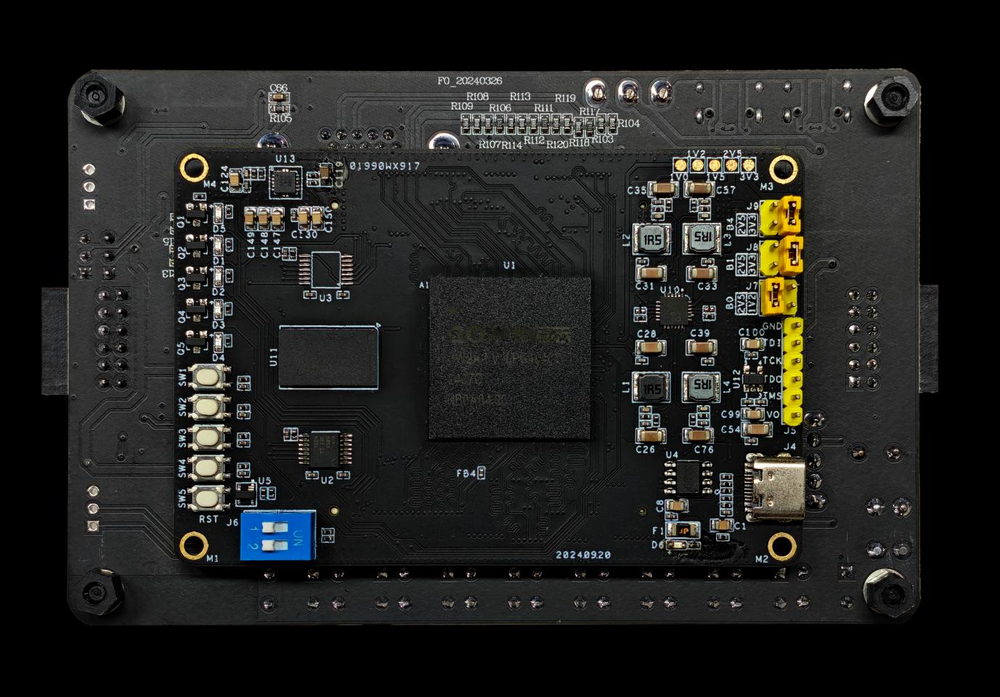
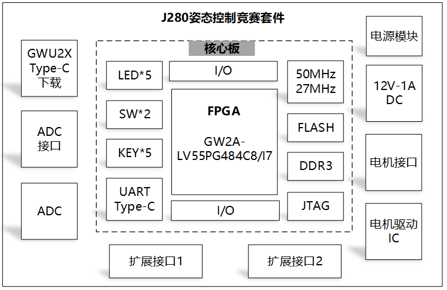
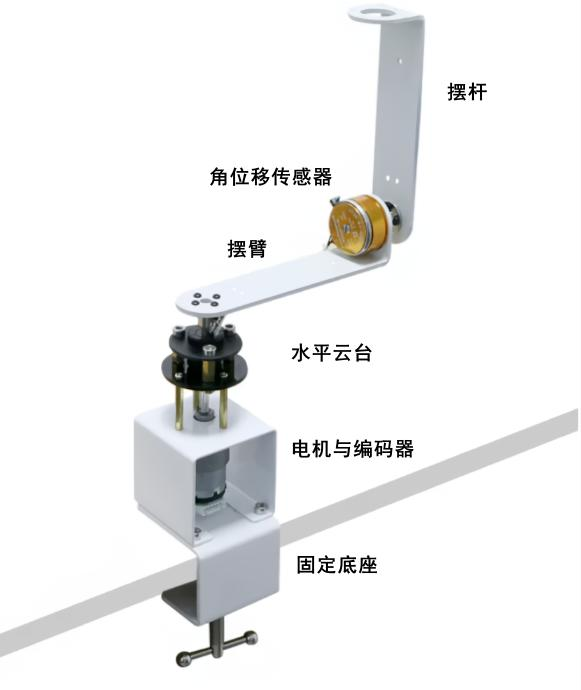

# 全国大学生嵌入式芯片与系统设计竞赛'2026
## FPGA 创新设计赛道 —— 选题一：基于 FPGA 的实时姿态控制系统

> **企业命题方**：广东高云半导体科技股份有限公司（Gowin Semiconductor）  
> **适用赛题**：选题一  
> **适配套件**：J280 姿态控制系统竞赛套件（搭载高云 GW2A-55 系列 FPGA）  

---

## 目录
1. [赛题详细要求](#一赛题详细要求)
   - [设计要求](#1-设计要求)
   - [基础要求](#2-基础要求)
   - [拓展要求](#3-拓展要求)
   - [适配板卡](#4-适配板卡)
2. [竞赛技术平台（J280 姿态控制系统竞赛套件）](#二竞赛技术平台j280-姿态控制系统竞赛套件)
   - [硬件架构与核心芯片](#1-硬件架构与核心芯片)
   - [运动机构与传感器组成](#2-运动机构与传感器组成)
   - [工作原理与控制需求](#3-工作原理与控制需求)
3. [开发板获取与采购途径](#三开发板获取与采购途径)
   - [免费申请规则](#1-免费申请)
   - [采购途径](#2-采购途径)
4. [官方技术支持与资源](#四官方技术支持与资源)
5. [技术实现与算法要点解析](#五技术实现与算法要点解析建议参考)

---

## 一、赛题详细要求

### 1. 设计要求
设计一套基于倒立摆的实时姿态控制系统。
* **信号采集**：系统通过角度传感器与编码器，实时、精确地采集摆杆倾角、电机转速及旋转方向；
* **主控计算平台**：采用 **FPGA** 作为主控计算平台，在其内部实现姿态控制算法，根据反馈信息在线计算控制量；
* **执行驱动**：输出 **PWM 驱动信号**至直流电机，以实现摆杆的稳定直立控制；
* **高级控制**：在此基础上，系统在稳态条件下具备摆臂定点位置调节能力，可在维持摆杆不倒的同时完成指定位移控制，从而构建一个具有自平衡能力与可控运动能力的实时姿态控制系统。

### 2. 基础要求
1. **摆杆起摆控制**：设计并实现一个控制逻辑，使得静止下垂的摆杆能够被抬起，在起摆时控制电机控制转速和转向，摆杆最终实现停在垂直位置附近。
2. **摆杆自平衡控制**：设计并完成一套自平衡控制系统算法。系统能实时采集摆杆角度偏差，通过 FPGA 逻辑运算输出 PWM 占空比，控制电机的转速和转向，使倒立的摆杆能够长时间稳定地保持在垂直平衡位置。
3. **稳定性与抗扰能力**：
   - 摆杆起摆时，要求在平衡后，摆杆会缓慢停在垂直位置附近，无明显震荡；
   - 在平衡控制时，摆杆长时间保持稳定，不倒下；
   - 能抵抗轻微的外部推力，并在短时间内恢复稳定。

### 3. 拓展要求
1. **定点位置控制**：在保持摆杆平衡的基础上，加入位置控制，通过键盘或拨码开关设定目标位置，控制电机平滑地移动到指定方向并保持静止；
2. **轨迹与速度跟踪**：可尝试让电机按照特定的速度曲线或轨迹运动，同时保持摆杆不倒；
3. **动态姿态保持**：在位置控制过程中，需要保证摆杆在移动过程中始终保持直立。

### 4. 适配板卡
* **J280 姿态控制系统竞赛套件**

---

## 二、竞赛技术平台（J280 姿态控制系统竞赛套件）

J280 姿态控制系统竞赛套件由 **FPGA 控制板** 与 **运动机构** 两个部分组成。

### 1. 硬件架构与核心芯片
* **核心架构**：FPGA 控制板采用**核心板 + 底板**架构设计，搭载高云 **GW2A-55** 系列 FPGA 芯片；
* **核心芯片型号**：高云晨熙家族系列第一代产品 **GW2A-LV55PG484C8/I7**；
* **封装规格**：BGA 形式 484 脚封装；
* **芯片资源与优势**：
  - 功耗低、性能强、资源丰富、使用方便；
  - 具备高性能的 DSP 资源、高速 LVDS 接口以及丰富的 BSRAM 存储器资源；
  - 精简 FPGA 架构与 55nm 工艺，适用于高速低成本应用场合；
  - **板载下载器**：套件自带下载器电路，仅需一根 USB 电缆线即可完成供电与在线调试/程序下载。



### 2. 运动机构与传感器组成
* **电控器件**：
  - **角位移传感器**：用于高精度实时监测倒立摆摆杆的绝对/相对倾角；
  - **直流电机**：执行机构，响应 PWM 控制信号，驱动水平转臂转动；
  - **正交编码器**：用于精确测量电机的旋转角度、角速度与转向。
* **机械结构件**：
  - 固定底座、水平旋转云台、摆臂、摆杆等机械组件。

| 运动机构俯视/局部结构 | 倒立摆整机实物结构 |
| :---: | :---: |
|  |  |

### 3. 工作原理与控制需求
* **闭环反馈调控**：系统基于闭环反馈控制，通过机械结构的协同运动与传感器的实时监测，实现对不稳定平衡状态的稳定调控。
* **FPGA 核心任务**：
  1. 高速采集角位移传感器信号与电机编码器 AB 相正交信号；
  2. 实时解算当前系统状态（摆杆角度 $\theta$、角速度 $\dot{\theta}$、摆臂位置 $\alpha$、摆臂角速度 $\dot{\alpha}$ 等）；
  3. 控制直流电机的转速和转向，使倒立的摆杆能够长时间稳定保持在垂直倒立平衡位置。
* **非线性与不稳定特性**：姿态控制系统的动力学特性高度非线性与不稳定，运动微分方程涉及角度、角速度、力矩、惯性矩等多变量耦合，要求控制算法具备快速响应能力与高精度控制品质。

---

## 三、开发板获取与采购途径

### 1. 免费申请
* **申请方式**：在报名参赛时同时勾选申请板卡；
* **名额限制**：每支队伍仅能申请一块开发板；
* **评审规则**：高云将根据队伍的项目申报方案评审后，在获得参赛资格的队伍中抽取并统一寄送；
* **申请渠道（官方申请网址）**：
  👉 [https://www.gowinsemi.com.cn/university/boardapply/2026](https://www.gowinsemi.com.cn/university/boardapply/2026)
* **板卡归还要求**：完赛后需寄回板卡至官方指定地址：
  - **收件地址**：广州市黄埔区科学大道235号601房
  - **收件人**：朱俊香
  - **联系电话**：18389838792

### 2. 采购途径
如需自行采购 J280 姿态控制系统竞赛套件，官方提供的采购地址与淘口令：
* **采购链接**：[https://e.tb.cn/h.8TDy8fxAwEnTyWF?tk=68iFgAHZ6I1](https://e.tb.cn/h.8TDy8fxAwEnTyWF?tk=68iFgAHZ6I1)

---

## 四、官方技术支持与资源

1. **FPGA 竞赛官方指导 QQ 群**：`213923272`
2. **高云官方网站**：[http://www.gowinsemi.com.cn](http://www.gowinsemi.com.cn)
3. **线上视频课程**：高云 B 站官方线上课程（Bilibili 搜索“高云半导体”官方账号获取 FPGA 软硬件入门及案例教程）

---

## 五、技术实现与算法要点解析（建议参考）

为了帮助队伍更好地准备选题一，以下梳理系统核心架构与关键算法攻关点：

```mermaid
flowchart TD
    subgraph 传感器与输入
        AS[角位移传感器<br/>(摆杆倾角)]
        ENC[电机正交编码器<br/>(位置/速度/转向)]
        KEY[拨码开关 / 键盘 / 串口指令<br/>(目标设定)]
    end

    subgraph FPGA 硬件逻辑控制 (GW2A-LV55)
        DEC_ANG[角度采集与滤波模块]
        DEC_ENC[编码器四倍频与测速模块]
        
        CTRL_FSM{状态切换控制器<br/>(起摆 / 平衡 / 定位 / 保护)}
        
        SWING[能量起摆控制算法<br/>(非线性能量增益控制)]
        BAL[直立平衡控制算法<br/>(角位移 PD / LQR)]
        POS[位置与轨迹控制算法<br/>(电机位置 PID / 轨迹规划)]
        
        PWM_GEN[PWM 输出与方向逻辑发生器]
    end

    subgraph 执行机构与对象
        DRV[直流电机驱动 H 桥电路]
        MOTOR[直流减速电机]
        MECH[旋转倒立摆运动机构]
    end

    AS --> DEC_ANG
    ENC --> DEC_ENC
    KEY --> CTRL_FSM

    DEC_ANG --> CTRL_FSM
    DEC_ENC --> CTRL_FSM

    CTRL_FSM -->|倾角不在倒立区| SWING
    CTRL_FSM -->|倾角进入线性区| BAL
    CTRL_FSM -->|稳态微调/定点| POS

    SWING --> PWM_GEN
    BAL --> PWM_GEN
    POS --> PWM_GEN

    PWM_GEN --> DRV
    DRV --> MOTOR
    MOTOR --> MECH
    MECH -.->|物理反馈| AS
    MECH -.->|机械联动| ENC
```

### 关键技术点分解
1. **信号采集与滤波**：
   - 角度传感器通常为精密导电塑料电位器或磁编码器，需通过 FPGA 内部或板载 ADC 进行高采样率采样，并设计一阶低通滤波或滑动平均滤波，消除机械抖动噪声；
   - 电机光电编码器采用正交编码器 4 倍频鉴相与脉冲计数，以获取微秒级精确位置与转速。
2. **起摆控制（基础要求 1）**：
   - 倒立摆从下垂状态（静止）到直立具有强非线性，无法直接使用线性 PID 控制；
   - 常用算法：**基于能量的非线性起摆控制（Energy-based Swing-up Control）** 或根据摆杆角速度符号输出脉冲振荡的 **Bang-Bang 变结构起摆控制**，通过转臂周期性晃动将机械能泵入摆杆，直至摆杆靠近垂直平衡点。
3. **自平衡控制（基础要求 2 & 3）**：
   - 当摆杆进入垂直平衡点附近线性区间（如 $\pm 15^\circ$ 内），控制器平滑切换为平衡模式；
   - 常用算法：**角度 PD 控制器** 或 **LQR（线性二次型调节器状态反馈控制）**；
   - FPGA 采用纯硬件流水线计算，控制周期可压缩至数百微秒以下，相比传统单片机拥有极高的采样与闭环响应带宽，抗外部扰动能力极强。
4. **定点与轨迹控制（拓展要求 1 & 2 & 3）**：
   - 双闭环/多闭环串级控制架构：外环为**转臂位置/速度环**，内环为**摆杆自平衡直立环**；
   - 通过将位置偏差解算为直立角度的微小修正量（前馈/级联），实现一边平滑移动到指定坐标、一边动态维持摆杆不倒下。
